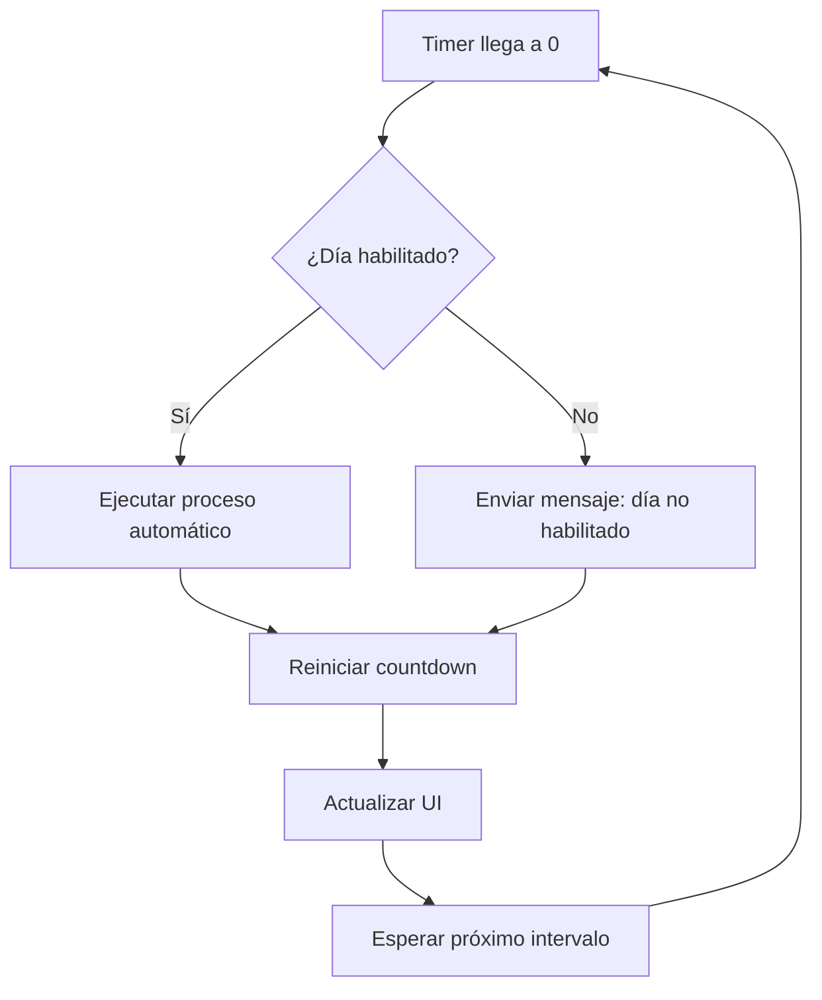

# INFORME TÉCNICO - PROYECTO MP (Mercado Pago Reports)

## RESUMEN EJECUTIVO

**Proyecto:** Sistema de Reportes de Pagos Mercado Pago  
**Versión:** 1.0.1  
**Tecnologías:** TypeScript + Electron + Node.js  
**Propósito:** Generación automatizada de reportes operativos de ventas desde Mercado Pago

---

## ARQUITECTURA DEL SISTEMA

### 1. ESTRUCTURA GENERAL

El proyecto implementa una **arquitectura híbrida** con dos modos de operación:

#### 1.1 Aplicación de Escritorio (Electron)
- **Entrada:** `src/main.ts` - Proceso principal de Electron
- **Interfaz:** `public/` - Archivos HTML/CSS para GUI
- **Servicios:** `src/services/` - Lógica de negocio
- **Salida:** Archivos en `C:\2_mp\reportes\` o `Documentos/MP-Reportes/`

#### 1.2 CLI (Command Line Interface)
- **Entrada:** `mp-sdk/report.ts` - Script independiente
- **Servicios:** `mp-sdk/services/` - Lógica compartida
- **Salida:** Archivos en `out/` (carpeta temporal)

### 2. COMPONENTES PRINCIPALES

```
mp/
├── src/                    # Aplicación Electron
│   ├── main.ts            # Proceso principal
│   ├── preload.ts         # Bridge IPC
│   ├── renderer.ts        # Renderer process
│   ├── caja.ts           # Lógica de interfaz caja
│   └── services/         # Servicios de negocio
├── mp-sdk/               # CLI independiente
│   ├── report.ts         # Script principal CLI
│   └── services/         # Servicios compartidos
├── public/               # Interfaz de usuario
└── dist/                 # Código compilado
```

---

## FUNCIONALIDADES CORE

### 1. INTEGRACIÓN CON MERCADO PAGO

#### 1.1 Autenticación
- **Método:** Access Token de producción (`APP_USR-...`)
- **Configuración:** Variables de entorno o GUI
- **Seguridad:** Almacenamiento encriptado con `electron-store`

#### 1.2 Consulta de Pagos
- **API:** `payments/search` del SDK oficial
- **Filtros:** Fechas, estados, paginación
- **Campos:** Transacciones, devoluciones, comisiones

### 2. GENERACIÓN DE REPORTES

#### 2.1 Formatos de Salida
| Archivo | Descripción | Uso |
|---------|-------------|-----|
| `transactions-YYYY-MM-DD.csv` | CSV curado | Operaciones principales |
| `transactions-full-YYYY-MM-DD.csv` | CSV completo | Todos los campos aplanados |
| `transactions-full-YYYY-MM-DD.xlsx` | Excel | Tabla con filtros |
| `transactions-detailed-YYYY-MM-DD.dbf` | DBF | Compatible dBase |
| `balance-YYYY-MM-DD.json` | JSON | Resumen y totales |

#### 2.2 Procesamiento de Datos
```typescript
// Mapeo de transacciones
function mapDetailedRow(payment: any) {
    return {
        operation_id: payment.id,
        status: payment.status,
        transaction_amount: payment.transaction_amount,
        net_received_amount: payment.transaction_details?.net_received_amount,
        // ... +40 campos más
    };
}
```

### 3. CONFIGURACIÓN Y PERSONALIZACIÓN

#### 3.1 Variables de Entorno (.env)
```env
# Mercado Pago
MP_ACCESS_TOKEN=APP_USR_xxx
MP_USER_ID=me

# Filtros de fecha
MP_TZ=America/Argentina/Buenos_Aires
MP_DATE_FROM=YYYY-MM-DD
MP_DATE_TO=YYYY-MM-DD

# Configuración de búsqueda
MP_RANGE=date_last_updated
MP_STATUS=approved
MP_LIMIT=50
MP_MAX_PAGES=100

# Email (opcional)
EMAIL_REPORT=contabilidad@empresa.com
SMTP_HOST=smtp.gmail.com
SMTP_PORT=587
```

#### 3.2 Configuración GUI
- **Modo Caja:** Interfaz compacta para operaciones diarias
- **Modo Configuración:** Panel completo de configuración
- **Persistencia:** Configuración encriptada en `electron-store`

---

## NUEVAS FUNCIONALIDADES IMPLEMENTADAS

### 1. SISTEMA DE AUTOMATIZACIÓN AVANZADO

#### 1.1 Botón Dinámico con Contador Regresivo
**Ubicación:** Modo Caja - Esquina inferior izquierda

**Características:**
- **Transformación:** De indicador estático a botón clickeable
- **Estados Visuales:**
  - 🟢 **Verde:** `"auto:On"` (activo)
  - 🔴 **Rojo:** `"auto:Off"` (pausado)
  - ⚫ **Gris:** `"auto:Desactivado"` (inactivo)
  - ⚫ **Gris:** `"Desact.(día)"` (día no habilitado)

**Funcionalidades:**
- **Click para Pausar/Reanudar:** Control directo del modo automático
- **Contador Regresivo:** Formato ⏱ MM:SS con actualización cada segundo
- **Bucle Continuo:** Reinicio automático al llegar a cero
- **Persistencia:** Estado mantenido al reiniciar la aplicación

#### 1.2 Selector de Días de la Semana
**Ubicación:** Modo Administrador - Sección Automatización

**Características:**
- **7 Checkboxes:** Lunes a Domingo en layout grid 2x4
- **Estado Inicial:** Todos marcados por defecto
- **Persistencia:** Guardado junto con configuración de automatización

**Funcionalidades:**
- **Verificación Automática:** Antes de cada ejecución automática
- **Salto Inteligente:** Si el día no está habilitado, se salta la ejecución
- **Feedback Visual:** Mensaje informativo en logs y botón
- **Control Granular:** Permite configurar exactamente qué días ejecutar

### 2. ARQUITECTURA DE AUTOMATIZACIÓN

#### 2.1 Variables de Estado (Main Process)
```typescript
let autoTimer: NodeJS.Timeout | null = null;
let autoActive = false;
let autoPaused = false;
let remainingSeconds = 0;
let countdownTimer: NodeJS.Timeout | null = null;
```

#### 2.2 Función de Verificación de Días
```typescript
function isDayEnabled(): boolean {
    const cfg: any = store.get('config') || {};
    const today = new Date().getDay(); // 0 = Domingo, 1 = Lunes, ..., 6 = Sábado
    
    const dayConfigs = [
        cfg.AUTO_DAYS_SUNDAY,    // 0 = Domingo
        cfg.AUTO_DAYS_MONDAY,    // 1 = Lunes
        cfg.AUTO_DAYS_TUESDAY,   // 2 = Martes
        cfg.AUTO_DAYS_WEDNESDAY, // 3 = Miércoles
        cfg.AUTO_DAYS_THURSDAY,  // 4 = Jueves
        cfg.AUTO_DAYS_FRIDAY,    // 5 = Viernes
        cfg.AUTO_DAYS_SATURDAY   // 6 = Sábado
    ];
    
    return dayConfigs[today] !== false;
}
```

#### 2.3 Contador Regresivo en Bucle
```typescript
function startCountdown(seconds: number) {
    remainingSeconds = seconds;
    if (countdownTimer) clearInterval(countdownTimer);
    
    countdownTimer = setInterval(() => {
        remainingSeconds--;
        if (remainingSeconds <= 0) {
            // Reiniciar el countdown con los segundos configurados
            remainingSeconds = seconds;
        }
        // Notificar a la UI el tiempo restante
        if (mainWindow) {
            mainWindow.webContents.send('auto-timer-update', { 
                remaining: remainingSeconds,
                configured: seconds
            });
        }
    }, 1000);
}
```

### 3. COMUNICACIÓN IPC MEJORADA

#### 3.1 Nuevos Handlers IPC
```typescript
// Pausar/Reanudar automatización
ipcMain.handle('auto-pause', async () => { /* lógica */ });
ipcMain.handle('auto-resume', async () => { /* lógica */ });

// Obtener información del timer
ipcMain.handle('auto-get-timer', async () => { /* lógica */ });

// Actualizaciones del timer en tiempo real
mainWindow.webContents.send('auto-timer-update', { remaining, configured });
```

#### 3.2 Bridge Preload Actualizado
```typescript
contextBridge.exposeInMainWorld('api', {
    // ... funciones existentes ...
    async pauseAuto() { return await ipcRenderer.invoke('auto-pause'); },
    async resumeAuto() { return await ipcRenderer.invoke('auto-resume'); },
    async getAutoTimer() { return await ipcRenderer.invoke('auto-get-timer'); },
    onAutoTimerUpdate(callback: (payload: any) => void) {
        ipcRenderer.on('auto-timer-update', (_e, payload) => callback(payload));
    },
});
```

---

## FLUJO DE DATOS

### 1. PROCESO PRINCIPAL

```mermaid
graph TD
    A[Inicio] --> B[Configuración]
    B --> C[Autenticación MP]
    C --> D[Consulta API]
    D --> E[Procesamiento]
    E --> F[Generación Archivos]
    F --> G[Email (opcional)]
    G --> H[Logs]
```

### 2. FLUJO DE AUTOMATIZACIÓN



### 3. DETALLE DE CONSULTA

```typescript
// 1. Construcción de filtros
const options = {
    range: 'date_last_updated',
    begin_date: '2024-01-01T00:00:00Z',
    end_date: '2024-01-01T23:59:59Z',
    status: 'approved',
    limit: 50,
    offset: 0
};

// 2. Paginación automática
for (let page = 0; page < maxPages; page++) {
    const response = await payment.search({ options });
    allPayments.push(...response.results);
    if (response.results.length < limit) break;
    offset += limit;
}
```

### 4. TRANSFORMACIÓN DE DATOS

```typescript
// Normalización de pagos
const detailed = payments.map(payment => ({
    // Campos operativos
    operation_id: payment.id,
    status: payment.status,
    
    // Información financiera
    transaction_amount: payment.transaction_amount,
    net_received_amount: payment.transaction_details?.net_received_amount,
    fees_total: calculateFees(payment.fee_details),
    
    // Información del pagador
    payer_email: payment.payer?.email,
    payer_doc_number: payment.payer?.identification?.number,
    
    // Información de pago
    payment_method_id: payment.payment_method_id,
    installments: payment.installments,
    card_last_four_digits: payment.card?.last_four_digits
}));
```

---

## SERVICIOS IMPLEMENTADOS

### 1. MercadoPagoService
**Responsabilidad:** Comunicación con API de Mercado Pago
- Autenticación y configuración del cliente
- Consulta paginada de pagos
- Manejo de filtros y rangos de fecha
- Normalización de respuestas

### 2. ReportService
**Responsabilidad:** Generación de archivos de reporte
- Creación de CSV, XLSX, DBF y JSON
- Mapeo de datos a formatos específicos
- Cálculo de totales y resúmenes
- Gestión de directorios de salida

### 3. EmailService
**Responsabilidad:** Envío de reportes por email
- Configuración SMTP
- Adjuntado de archivos
- Manejo de errores de envío

### 4. FtpService
**Responsabilidad:** Transferencia FTP (funcionalidad futura)
- Conexión a servidores FTP
- Envío de archivos DBF
- Configuración de credenciales

### 5. LogService
**Responsabilidad:** Registro de actividades
- Logs diarios en archivos separados
- Formato estructurado
- Rotación automática

---

## INTERFACES DE USUARIO

### 1. Modo Caja (Interfaz Principal)
- **Propósito:** Operaciones diarias rápidas
- **Tamaño:** 420x320px (compacto)
- **Funcionalidades:**
  - Botón de descarga principal
  - Vista de tabla de transacciones
  - Logs en tiempo real
  - **Botón dinámico automático** con contador regresivo
  - **Indicador de día habilitado/deshabilitado**

### 2. Modo Configuración
- **Propósito:** Configuración completa del sistema
- **Tamaño:** 1200x768px (amplio)
- **Secciones:**
  - Credenciales Mercado Pago
  - Configuración de fechas
  - Configuración de email
  - Configuración FTP
  - **Selector de días de la semana**
  - Configuración de logs

### 3. Características de UI
- **Framework:** Tailwind CSS
- **Tema:** Dark mode (slate-800)
- **Responsive:** Adaptable a diferentes tamaños
- **Accesibilidad:** Navegación por teclado
- **Espaciado Mejorado:** 80px de margen inferior para separar contenido del footer

---

## CONFIGURACIÓN DE DESARROLLO

### 1. Requisitos del Sistema
```bash
Node.js 18+
TypeScript 5.9+
Electron 30.0+
```

### 2. Instalación
```bash
npm install
npm run build:ts
```

### 3. Scripts Disponibles
```json
{
  "start": "npm run build:ts && electron .",
  "build": "electron-builder -w",
  "build:ts": "tsc -p tsconfig.json",
  "mp:payments:report:dist": "npm run build:ts && node dist/mp-sdk/report.js"
}
```

### 4. Configuración TypeScript
- **Target:** ES2020
- **Module:** CommonJS
- **Strict:** false (compatibilidad)
- **OutDir:** dist/

---

## DESPLIEGUE Y DISTRIBUCIÓN

### 1. Construcción para Windows
```bash
# En Windows
npm ci
npm run build:ts
npx electron-builder -w
```

### 2. Archivos de Salida
- **Instalador:** `dist/Tc-Mp ver.1.0.1.exe`
- **Configuración:** NSIS (instalador automático)
- **Iconos:** build/icon.ico
- **Firma:** Opcional (variables CSC_*)

### 3. Configuración de Instalador
- **OneClick:** true (instalación automática)
- **Desktop Shortcut:** true
- **Start Menu:** true
- **PerMachine:** false (usuario actual)

---

## MONITOREO Y LOGS

### 1. Sistema de Logs
- **Ubicación:** `logs/YYYY-MM-DD.log`
- **Formato:** Timestamp + Nivel + Mensaje
- **Rotación:** Diaria automática

### 2. Métricas Clave
- Cantidad de transacciones procesadas
- Tiempo de ejecución
- Errores de API
- Estado de envío de emails
- **Estado de automatización (activo/pausado)**
- **Días habilitados para ejecución**

### 3. Troubleshooting
```bash
# Verificar conexión
npm run test-connection

# Logs detallados
tail -f logs/$(date +%Y-%m-%d).log

# Diagnóstico sin filtros
MP_NO_DATE_FILTER=true npm run mp:payments:report:dist

# Verificar estado de automatización
# Revisar logs para mensajes de "día no habilitado"
```

---

## SEGURIDAD

### 1. Almacenamiento de Credenciales
- **Método:** Encriptación AES con `electron-store`
- **Clave:** Generada automáticamente en `config.key`
- **Ubicación:** `app.getPath('userData')`

### 2. Validaciones
- Verificación de tokens de acceso
- Validación de formatos de fecha
- Sanitización de datos de entrada
- **Validación de días habilitados**

### 3. Permisos
- Acceso limitado a directorios específicos
- Validación de rutas de archivos
- Control de acceso a APIs externas

---

## ESTRUCTURA DE CONFIGURACIÓN

### 1. Configuración de Automatización
```json
{
  "AUTO_INTERVAL_SECONDS": 3600,
  "AUTO_DAYS_MONDAY": true,
  "AUTO_DAYS_TUESDAY": true,
  "AUTO_DAYS_WEDNESDAY": true,
  "AUTO_DAYS_THURSDAY": true,
  "AUTO_DAYS_FRIDAY": true,
  "AUTO_DAYS_SATURDAY": false,
  "AUTO_DAYS_SUNDAY": false
}
```

### 2. Mapeo de Días
- **0 (Domingo):** `AUTO_DAYS_SUNDAY`
- **1 (Lunes):** `AUTO_DAYS_MONDAY`
- **2 (Martes):** `AUTO_DAYS_TUESDAY`
- **3 (Miércoles):** `AUTO_DAYS_WEDNESDAY`
- **4 (Jueves):** `AUTO_DAYS_THURSDAY`
- **5 (Viernes):** `AUTO_DAYS_FRIDAY`
- **6 (Sábado):** `AUTO_DAYS_SATURDAY`

---

## ROADMAP Y MEJORAS FUTURAS

### 1. Funcionalidades Planificadas
- [ ] Reportes de Liquidaciones/Finanzas
- [ ] Snapshot de saldo en tiempo real
- [ ] Webhooks para notificaciones
- [ ] Exportación a PDF
- [ ] Dashboards interactivos
- [ ] **Configuración de horarios específicos por día**
- [ ] **Notificaciones push para eventos automáticos**

### 2. Mejoras Técnicas
- [ ] Migración a TypeScript strict mode
- [ ] Implementación de tests unitarios
- [ ] Optimización de consultas API
- [ ] Sistema de métricas avanzado
- [ ] **Optimización del contador regresivo**
- [ ] **Persistencia mejorada del estado de pausa**

### 3. Integraciones
- [ ] APIs de contabilidad
- [ ] Sistemas de facturación
- [ ] Plataformas de BI

---

## CONSIDERACIONES TÉCNICAS

### 1. Limitaciones Conocidas
- **API Rate Limits:** Máximo 100 páginas por consulta
- **Zona Horaria:** Requiere configuración explícita
- **Tamaño de Archivos:** Limitado por memoria disponible
- **Contador Regresivo:** Sincronización con reloj del sistema

### 2. Dependencias Críticas
- `mercadopago`: SDK oficial (v2.8.0)
- `electron-store`: Persistencia encriptada
- `dayjs`: Manejo de fechas y zonas horarias
- `exceljs`: Generación de archivos Excel

### 3. Compatibilidad
- **Windows:** 10/11 (principal)
- **Linux:** WSL2 (desarrollo)
- **macOS:** No probado

---

## CONCLUSIÓN

El proyecto MP implementa una solución robusta para la generación automatizada de reportes de Mercado Pago, combinando la flexibilidad de una aplicación de escritorio con la eficiencia de scripts CLI. La arquitectura modular permite fácil mantenimiento y extensión, mientras que las múltiples opciones de configuración se adaptan a diferentes necesidades operativas.

**Nuevas Funcionalidades Clave:**
- **Sistema de automatización avanzado** con control granular por días de la semana
- **Botón dinámico con contador regresivo** para control intuitivo del modo automático
- **Persistencia de estado** que mantiene la configuración entre sesiones
- **Feedback visual mejorado** con indicadores de estado claros y concisos

**Puntos Clave:**
- Integración completa con API oficial de Mercado Pago
- Generación de múltiples formatos de reporte
- Interfaz dual (GUI + CLI) para diferentes casos de uso
- Sistema de configuración flexible y seguro
- Logs detallados para monitoreo y troubleshooting
- **Control granular de automatización por días de la semana**
- **Interfaz intuitiva para pausar/reanudar procesos automáticos**

El código está estructurado para facilitar la comprensión y mantenimiento por parte de otros desarrolladores, con documentación inline y separación clara de responsabilidades. Las nuevas funcionalidades de automatización proporcionan un control total sobre cuándo y cómo se ejecutan los procesos automáticos, mejorando significativamente la experiencia del usuario.
