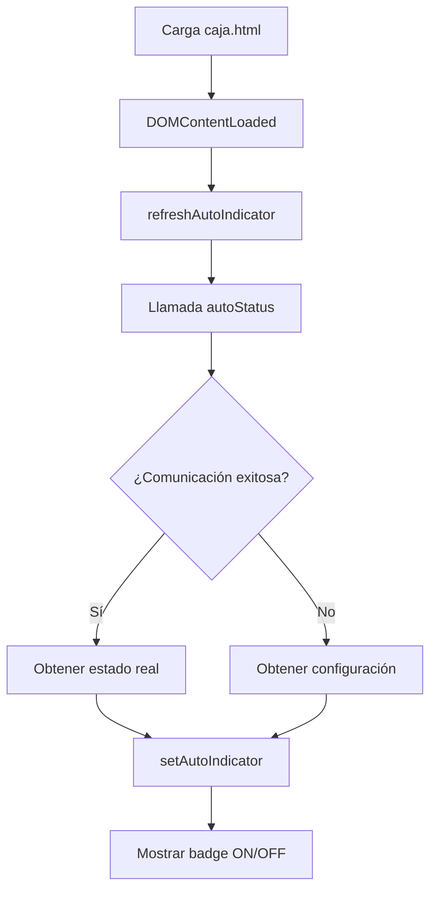
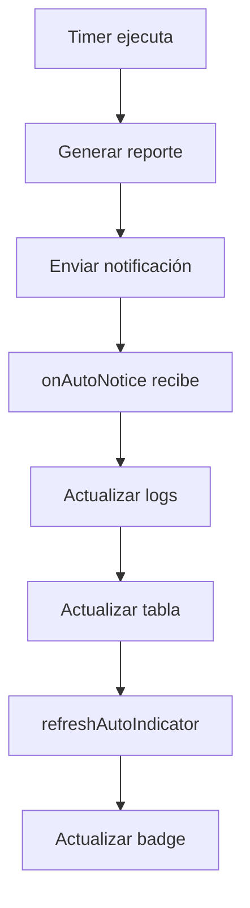
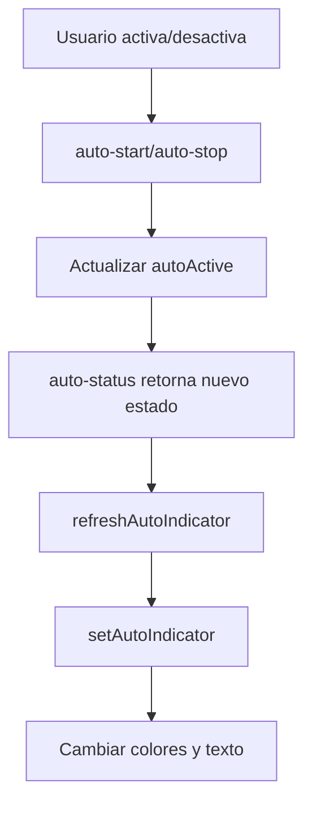

# MODO CAJA - INDICADOR AUTOMÁTICO - FUNCIONAMIENTO DETALLADO

## RESUMEN EJECUTIVO

El **Modo Caja** es la interfaz principal y compacta del proyecto MP, diseñada para operaciones diarias rápidas. Incluye un **indicador visual del modo automático** que muestra en tiempo real si la automatización está activa o inactiva, proporcionando feedback inmediato al usuario sobre el estado del sistema.

---

## ARQUITECTURA DEL MODO CAJA

### 1. COMPONENTES PRINCIPALES

#### 1.1 Estructura de Archivos
- **Interfaz:** `public/caja.html` - HTML y estructura visual
- **Lógica:** `src/caja.ts` - Funcionalidad JavaScript/TypeScript
- **Estilos:** `public/style.css` + Tailwind CSS
- **Compilado:** `dist/src/caja.js` - Versión compilada

#### 1.2 Elementos de Interfaz
- **Navegación:** Tabs "Inicio" y "Tabla"
- **Botón Principal:** "DESCARGAR MP" para generación manual
- **Logs:** Área de logs en tiempo real
- **Tabla:** Vista de transacciones recientes
- **Indicadores:** Badge automático + fecha actual

---

## INDICADOR DEL MODO AUTOMÁTICO

### 1. ELEMENTO HTML

```html
<!-- En public/caja.html - Línea 50 -->
<footer class="fixed bottom-4 left-4">
    <span id="autoIndicatorCaja" class="px-3 py-1 rounded text-sm border"></span>
</footer>
```

**Características del Elemento:**
- **ID:** `autoIndicatorCaja`
- **Posición:** Esquina inferior izquierda (fixed)
- **Estilo Base:** Badge redondeado con borde
- **Clases CSS:** `px-3 py-1 rounded text-sm border`

### 2. FUNCIÓN DE ACTUALIZACIÓN

```typescript
// En src/caja.ts - Líneas 14-18
function setAutoIndicator(active: boolean) {
    const el = document.getElementById('autoIndicatorCaja');
    if (!el) return;
    el.textContent = active ? 'Modo automático: ON' : 'Modo automático: OFF';
    el.className = 'px-3 py-1 rounded text-sm border ' + 
        (active ? 'bg-emerald-700/30 text-emerald-300 border-emerald-600' : 
                 'bg-rose-700/30 text-rose-300 border-rose-600');
}
```

**Lógica de Actualización:**
1. **Obtención del Elemento:** Busca `autoIndicatorCaja` en el DOM
2. **Validación:** Verifica que el elemento existe
3. **Texto:** Cambia según el estado (ON/OFF)
4. **Estilos:** Aplica colores según el estado

### 3. ESTADOS VISUALES

#### 3.1 Estado ACTIVO (ON)
```css
/* Clases aplicadas cuando active = true */
bg-emerald-700/30    /* Fondo verde semi-transparente */
text-emerald-300     /* Texto verde claro */
border-emerald-600   /* Borde verde */
```
**Resultado Visual:** Badge verde con texto "Modo automático: ON"

#### 3.2 Estado INACTIVO (OFF)
```css
/* Clases aplicadas cuando active = false */
bg-rose-700/30       /* Fondo rojo semi-transparente */
text-rose-300        /* Texto rojo claro */
border-rose-600      /* Borde rojo */
```
**Resultado Visual:** Badge rojo con texto "Modo automático: OFF"

---

## DETECCIÓN DEL ESTADO AUTOMÁTICO

### 1. FUNCIÓN DE REFRESCO

```typescript
// En src/caja.ts - Líneas 20-26
async function refreshAutoIndicator() {
    try {
        const s = await (window.api as any).autoStatus?.();
        setAutoIndicator(!!(s as any)?.active);
    } catch {
        const cfg = await window.api.getConfig();
        setAutoIndicator(!!(cfg as any)?.AUTO_ENABLED);
    }
}
```

**Estrategia de Detección:**
1. **Intento Principal:** Llama a `autoStatus()` para obtener estado real
2. **Fallback:** Si falla, consulta configuración guardada
3. **Conversión:** Convierte a booleano con `!!`

### 2. COMUNICACIÓN CON MAIN PROCESS

#### 2.1 Handler en Main Process
```typescript
// En src/main.ts - Líneas 307-309
ipcMain.handle('auto-status', async () => {
    return { active: autoActive };
});
```

**Variable de Estado:**
- **`autoActive`:** Variable booleana en main process
- **Ubicación:** `src/main.ts` línea 256
- **Gestión:** Se actualiza en `startAutoTimer()` y `stopAutoTimer()`

#### 2.2 Bridge en Preload
```typescript
// En src/preload.ts - Línea 30
async autoStatus() {
    return await ipcRenderer.invoke('auto-status');
},
```

**Flujo de Comunicación:**
1. **Caja → Preload:** `window.api.autoStatus()`
2. **Preload → Main:** `ipcRenderer.invoke('auto-status')`
3. **Main → Preload:** Retorna `{ active: boolean }`
4. **Preload → Caja:** Promise resuelta con estado

### 3. FALLBACK A CONFIGURACIÓN

```typescript
// En src/caja.ts - Líneas 24-25
} catch {
    const cfg = await window.api.getConfig();
    setAutoIndicator(!!(cfg as any)?.AUTO_ENABLED);
}
```

**Caso de Fallback:**
- **Trigger:** Error en llamada a `autoStatus()`
- **Consulta:** Obtiene configuración completa
- **Campo:** Verifica `AUTO_ENABLED` en configuración
- **Uso:** Como indicador de configuración (no estado real)

---

## MOMENTOS DE ACTUALIZACIÓN

### 1. INICIALIZACIÓN

```typescript
// En src/caja.ts - Línea 155
refreshAutoIndicator();
```

**Cuándo:** Al cargar la página (DOMContentLoaded)
**Propósito:** Mostrar estado actual al abrir la aplicación

### 2. NOTIFICACIONES AUTOMÁTICAS

```typescript
// En src/caja.ts - Líneas 140-150
window.api.onAutoNotice?.((payload) => {
    if ((payload as any)?.error) {
        appendLog(`Auto: ${(payload as any).error}`);
    } else if ((payload as any)?.info) {
        appendLog(String((payload as any).info));
    } else if ((payload as any)?.count !== undefined) {
        appendLog(`Auto-reporte generado (${(payload as any)?.count ?? 0})`);
        const rows = (payload as any)?.rows;
        if (Array.isArray(rows)) {
            renderLast8(rows.map((r: any) => ({ id: r.id, status: r.status, amount: r.amount, date: r.date })));
        }
    }
    refreshAutoIndicator(); // ← Actualización aquí
});
```

**Cuándo:** Cada vez que llega una notificación automática
**Propósito:** Mantener indicador sincronizado con ejecuciones automáticas

### 3. CAMBIO DE VISTA

```typescript
// En src/caja.ts - Líneas 1-12
function selectPane(name: 'home' | 'table') {
    const home = document.getElementById('pane-home') as HTMLElement | null;
    const table = document.getElementById('pane-table') as HTMLElement | null;
    const badge = document.getElementById('todayBadge') as HTMLElement | null;
    const auto = document.getElementById('autoIndicatorCaja') as HTMLElement | null;
    if (!home || !table) return;
    home.style.display = name === 'home' ? 'block' : 'none';
    table.style.display = name === 'table' ? 'block' : 'none';
    if (badge) badge.style.display = name === 'home' ? 'inline-block' : 'none';
    if (auto) auto.style.display = name === 'home' ? 'inline-block' : 'none';
}
```

**Comportamiento:**
- **Vista "Inicio":** Indicador visible (`inline-block`)
- **Vista "Tabla":** Indicador oculto (`none`)

---

## INTEGRACIÓN CON EL SISTEMA

### 1. SINCRONIZACIÓN CON MAIN PROCESS

#### 1.1 Variables de Estado en Main
```typescript
// En src/main.ts - Líneas 256-257
let autoTimer: NodeJS.Timeout | null = null;
let autoActive = false;
```

**Gestión del Estado:**
- **`autoTimer`:** Referencia al timer activo
- **`autoActive`:** Estado booleano del modo automático
- **Sincronización:** Se actualiza en cada cambio de estado

#### 1.2 Actualización en Activación
```typescript
// En src/main.ts - Línea 295
autoActive = true;
```

**Cuándo:** Al iniciar `startAutoTimer()`
**Efecto:** Indicador cambia a verde

#### 1.3 Actualización en Desactivación
```typescript
// En src/main.ts - Línea 261
autoActive = false;
```

**Cuándo:** Al llamar `stopAutoTimer()`
**Efecto:** Indicador cambia a rojo

### 2. NOTIFICACIONES EN TIEMPO REAL

#### 2.1 Evento de Notificación
```typescript
// En src/main.ts - Líneas 275-295
mainWindow.webContents.send('auto-report-notice', { 
    when: new Date().toISOString(), 
    count: (payments as any[]).length, 
    rows: uiRows.slice(0,8) 
});
```

**Tipos de Notificación:**
- **`{ info: string }`:** Información general
- **`{ error: string }`:** Error ocurrido
- **`{ count: number, rows: array }`:** Resultado de ejecución
- **`{ when: string }`:** Timestamp de ejecución

#### 2.2 Escucha en Caja
```typescript
// En src/caja.ts - Líneas 140-150
window.api.onAutoNotice?.((payload) => {
    // Procesamiento de notificación
    refreshAutoIndicator(); // Actualización del indicador
});
```

**Flujo Completo:**
1. **Ejecución Automática:** Se ejecuta en main process
2. **Notificación:** Se envía a renderer process
3. **Procesamiento:** Se actualiza logs y tabla
4. **Indicador:** Se refresca el estado visual

---

## MANEJO DE ERRORES

### 1. ELEMENTO NO ENCONTRADO

```typescript
// En src/caja.ts - Líneas 15-16
const el = document.getElementById('autoIndicatorCaja');
if (!el) return;
```

**Protección:** Verifica que el elemento existe antes de modificarlo
**Comportamiento:** Sale silenciosamente si no encuentra el elemento

### 2. ERROR EN COMUNICACIÓN IPC

```typescript
// En src/caja.ts - Líneas 22-25
try {
    const s = await (window.api as any).autoStatus?.();
    setAutoIndicator(!!(s as any)?.active);
} catch {
    const cfg = await window.api.getConfig();
    setAutoIndicator(!!(cfg as any)?.AUTO_ENABLED);
}
```

**Estrategia de Recuperación:**
1. **Intento Principal:** Llama a `autoStatus()`
2. **Captura de Error:** Si falla la comunicación
3. **Fallback:** Usa configuración guardada
4. **Continuidad:** Mantiene funcionalidad básica

### 3. VALIDACIÓN DE DATOS

```typescript
// En src/caja.ts - Línea 23
setAutoIndicator(!!(s as any)?.active);
```

**Conversión Segura:**
- **`!!`:** Convierte cualquier valor a booleano
- **`?.`:** Acceso seguro a propiedades
- **Resultado:** Siempre un booleano válido

---

## CARACTERÍSTICAS DE USABILIDAD

### 1. VISIBILIDAD CONDICIONAL

```typescript
// En src/caja.ts - Líneas 10-11
if (auto) auto.style.display = name === 'home' ? 'inline-block' : 'none';
```

**Comportamiento:**
- **Vista "Inicio":** Indicador visible
- **Vista "Tabla":** Indicador oculto
- **Razón:** Interfaz más limpia en vista de tabla

### 2. POSICIONAMIENTO FIJO

```html
<!-- En public/caja.html - Línea 50 -->
<footer class="fixed bottom-4 left-4">
```

**Características:**
- **Posición:** Esquina inferior izquierda
- **Fijo:** No se mueve al hacer scroll
- **Z-index:** Siempre visible sobre otros elementos

### 3. ESTILOS RESPONSIVOS

```css
/* Clases aplicadas dinámicamente */
px-3 py-1          /* Padding horizontal y vertical */
rounded             /* Bordes redondeados */
text-sm             /* Tamaño de texto pequeño */
border              /* Borde visible */
```

**Adaptabilidad:**
- **Tamaño:** Se adapta al contenido
- **Colores:** Cambian según el estado
- **Legibilidad:** Alto contraste en ambos estados

---

## FLUJO COMPLETO DE FUNCIONAMIENTO

### 1. INICIO DE LA APLICACIÓN



### 2. EJECUCIÓN AUTOMÁTICA



### 3. CAMBIO DE ESTADO



---

## CONFIGURACIÓN Y PERSONALIZACIÓN

### 1. POSICIÓN DEL INDICADOR

```html
<!-- Ubicación actual -->
<footer class="fixed bottom-4 left-4">
```

**Opciones de Posicionamiento:**
- **Esquina inferior izquierda:** `bottom-4 left-4` (actual)
- **Esquina inferior derecha:** `bottom-4 right-4`
- **Esquina superior izquierda:** `top-4 left-4`
- **Centro inferior:** `bottom-4 left-1/2 transform -translate-x-1/2`

### 2. ESTILOS PERSONALIZABLES

```typescript
// Estados visuales configurables
const styles = {
    active: 'bg-emerald-700/30 text-emerald-300 border-emerald-600',
    inactive: 'bg-rose-700/30 text-rose-300 border-rose-600'
};
```

**Elementos Modificables:**
- **Colores:** Verde/rojo para estados
- **Transparencia:** `/30` para fondo semi-transparente
- **Tamaño:** `text-sm` para texto pequeño
- **Bordes:** `border` para contorno visible

### 3. TEXTO DEL INDICADOR

```typescript
// Textos configurables
el.textContent = active ? 'Modo automático: ON' : 'Modo automático: OFF';
```

**Opciones de Texto:**
- **Español:** "Modo automático: ON/OFF" (actual)
- **Inglés:** "Auto mode: ON/OFF"
- **Compacto:** "AUTO: ON/OFF"
- **Símbolos:** "🟢 AUTO" / "🔴 AUTO"

---

## TROUBLESHOOTING

### 1. INDICADOR NO SE MUESTRA

```bash
# Verificar elementos
- Elemento autoIndicatorCaja existe en HTML
- JavaScript se carga correctamente
- No hay errores en consola
- Vista "Inicio" está activa
```

### 2. INDICADOR NO CAMBIA DE ESTADO

```bash
# Verificar comunicación
- IPC funciona correctamente
- autoStatus retorna datos válidos
- refreshAutoIndicator se ejecuta
- setAutoIndicator recibe parámetro correcto
```

### 3. ESTADO INCORRECTO

```typescript
// Debug del estado
console.log('Estado automático:', await window.api.autoStatus());
console.log('Configuración:', await window.api.getConfig());
```

**Diagnóstico:**
- **Estado real:** `autoStatus().active`
- **Configuración:** `getConfig().AUTO_ENABLED`
- **Sincronización:** Comparar ambos valores

---

## CONSIDERACIONES TÉCNICAS

### 1. RENDIMIENTO

**Optimizaciones:**
- **Llamadas mínimas:** Solo cuando es necesario
- **Cache:** No se actualiza constantemente
- **DOM:** Modificación directa sin re-render
- **Async:** No bloquea la interfaz

### 2. CONFIABILIDAD

**Características:**
- **Fallback:** Múltiples fuentes de estado
- **Error handling:** Manejo robusto de errores
- **Validación:** Verificación de datos
- **Recuperación:** Estrategia de recuperación

### 3. MANTENIBILIDAD

**Estructura:**
- **Separación:** Lógica independiente
- **Reutilización:** Función `setAutoIndicator`
- **Configuración:** Estilos centralizados
- **Documentación:** Código autodocumentado

---

## CONCLUSIÓN

El **indicador del modo automático en el Modo Caja** es un componente crítico que proporciona feedback visual inmediato sobre el estado del sistema de automatización. Su implementación robusta, con múltiples estrategias de detección y manejo de errores, asegura que el usuario siempre tenga información precisa sobre el funcionamiento automático.

**Puntos Clave:**
- **Detección en tiempo real:** Estado actual del sistema
- **Fallback robusto:** Configuración como respaldo
- **Feedback visual:** Colores y texto claros
- **Integración completa:** Sincronización con main process
- **Usabilidad:** Posicionamiento y visibilidad optimizados

El indicador funciona como un "semáforo" del sistema, permitiendo al usuario saber instantáneamente si la automatización está funcionando, facilitando la operación diaria y el monitoreo del sistema.
