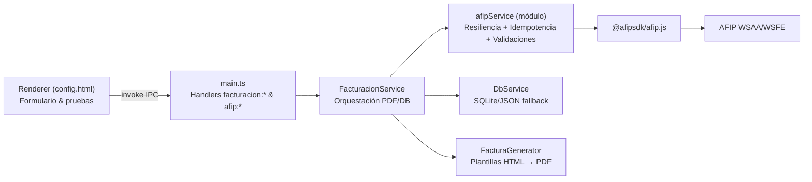
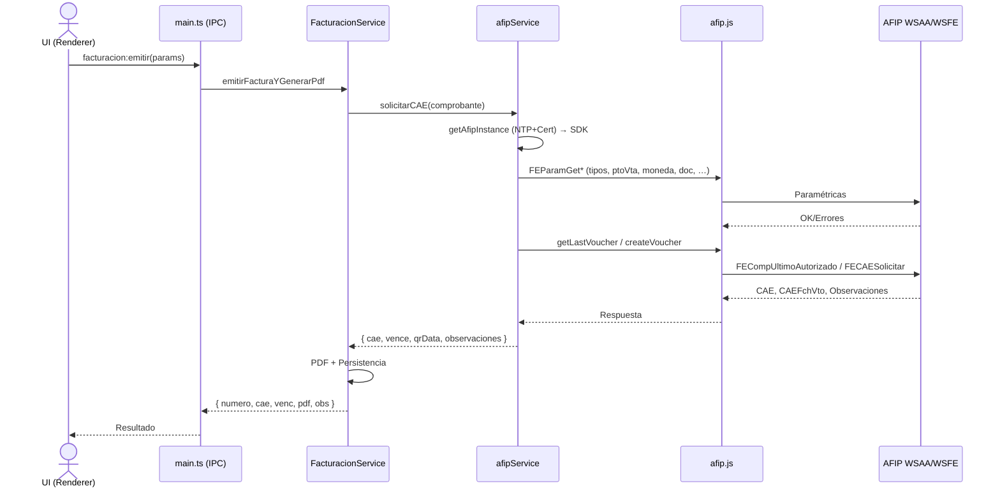

## Análisis del Módulo de Facturación

### 1. Resumen Ejecutivo

El módulo de facturación implementa la emisión de comprobantes electrónicos (AFIP WSFE) para un entorno Electron + Node.js. Orquesta captura de datos desde UI, validaciones locales y remotas, armado de payload conforme AFIP, solicitud de CAE, generación de PDF y persistencia local. Integra utilitarios de resiliencia, validación NTP/certificados, control de idempotencia, soporte para Monotributo y comprobantes asociados (NC/ND).

### 2. Arquitectura y Estructura

#### 2.1. Diagrama de Estructura de Carpetas

```
src/
  main.ts                 # IPC y arranque principal (Electron)
  preload.ts              # API segura para el renderer
  renderer.ts             # UI de configuración y pruebas
  services/
    FacturacionService.ts # Orquestación de emisión + PDF + persistencia
    AfipService.ts        # Implementación legacy mínima (no principal)
    DbService.ts          # Persistencia (SQLite/JSON fallback)
  modules/facturacion/
    afipService.ts        # Servicio AFIP principal (resiliencia, idempotencia, validaciones, CAE)
    afip/
      AfipValidator.ts    # Validaciones FEParamGet*
      CertificateValidator.ts
      CAEValidator.ts
      helpers.ts          # Mapas de tipo, IVA, QR, validaciones locales
      config.ts, ...      # Config de resiliencia
    provincia/
      ProvinciaManager.ts # Integración de administraciones provinciales (extensible)
    arca/
      ArcaAdapter.ts      # Validaciones específicas ARCA (flujo alternativo)
    types.ts              # Tipos de dominio (Comprobante, Empresa, etc.)
public/config.html        # UI de configuración y pruebas
```

#### 2.2. Patrones de Diseño Identificados

- Facade: `afipService.ts` encapsula `@afipsdk/afip.js` y expone operaciones de alto nivel (validar/emitir, check status, último comprobante).
- Adapter: `AfipValidator` traduce FEParamGet* a una validación semántica de negocio.
- Strategy/Policy: validaciones locales vs remotas (NTP, certificado, FEParamGet*), y flujo ARCA alternativo.
- Resilience patterns: `ResilienceWrapper` (retries/backoff; protección ante fallas de red/AFIP).
- Idempotency: `IdempotencyManager` evita doble emisión y recupera CAE previo si corresponde.
- Singleton: instancias compartidas de servicios (e.g. `afipService`, `FacturacionService`, caché de `Afip` SDK).
- Layered architecture: UI (renderer) → IPC (main/preload) → Services (Facturación/AFIP) → SDK AFIP → AFIP WS.

#### 2.3. Flujo Arquitectónico General



### 3. Análisis de Clases

#### 3.1. Clase Principal: `afipService` (src/modules/facturacion/afipService.ts)
- Propósito: Orquestar la emisión segura y robusta contra AFIP: carga de config, validación NTP/cert, validaciones paramétricas (FEParamGet*), idempotencia, resiliencia, armado de payload, solicitud de CAE, QR y salida enriquecida (observaciones).
- Métodos principales:
  - `getAfipInstance()`: crea (o reutiliza) `new Afip({ CUIT, production, cert, key })` tras validar NTP y certificado. Punto único de acceso al SDK.
  - `solicitarCAE(comprobante)`: flujo completo para WSFE. Incluye:
    1) Validación local (estructura/completitud)
    2) Validación FEParamGet* (`AfipValidator`)
    3) Obtención de último voucher (getLastVoucher) con `ResilienceWrapper`
    4) Control de idempotencia (duplicados en curso/previos)
    5) Armado del request `createVoucher`
    6) Ajustes específicos Monotributo para C (ImpIVA=0, Iva=[])
    7) `createVoucher` (con resiliencia)
    8) Marcado idempotente “aprobado” + QR + retorno `{ cae, vence, qrData, observaciones }`
  - `solicitarCAEConProvincias(comprobante)`: Variante que encadena `ProvinciaManager`.
  - Helpers de consulta: `getUltimoAutorizado`, `checkServerStatus`, validaciones de CAE, etc.
- Dependencias: `DbService` (config/empresa), `AfipValidator`, `CertificateValidator`, `ResilienceWrapper`, `IdempotencyManager`, `helpers`, `@afipsdk/afip.js`.

#### 3.2. `FacturacionService` (src/services/FacturacionService.ts)
- Propósito: Orquestar emisión end-to-end desde IPC: convierte entrada UI → `Comprobante`, invoca `afipService.solicitarCAE`, genera QR, produce PDF, persiste y retorna a la UI.
- Métodos:
  - `emitirFacturaYGenerarPdf(params)`: pipeline principal (mapear tipo, fechas, items, totales; compatibilidad Monotributo; solicitar CAE; QR; PDF; persistencia y respuesta incluyendo `observaciones`).
  - `emitirFacturaConProvincias(...)`: incluye post-proceso en jurisdicciones.
  - Utilitarios: `abrirPdf`, `buildQrAfipUrl`, `mapTipoComprobante` (mapeo numérico→clase).
- Dependencias: `afipService`, `DbService`, `FacturaGenerator`, `dayjs`.

#### 3.3. `AfipValidator` (src/modules/facturacion/afip/AfipValidator.ts)
- Propósito: Validar de forma proactiva los parámetros con AFIP usando FEParamGet*.
- Métodos: `validateComprobante({ cbteTipo, concepto, docTipo, monId, ptoVta, cuit })` que encadena `getVoucherTypes`, `getConceptTypes`, `getDocumentTypes`, `getCurrenciesTypes`, `getPointsOfSales`, `getCurrencyCotization` (cuando aplica), `getAliquotsTypes` (informativo).
- Dependencias: `@afipsdk/afip.js` (ElectronicBilling), logging.

#### 3.4. `helpers.ts` (src/modules/facturacion/afip/helpers.ts)
- Propósito: Funciones utilitarias y mapeos del dominio AFIP.
- Destacados: 
  - `mapTipoCbte` (A→1, B→6, C→11; NC por defecto a 13)
  - `mapCbteByClass(kind, clase)` (FACT/NC/ND × A/B/C)
  - `buildIvaArray`, `buildQrUrl`, `validateComprobante`, `formatNumber`.

#### 3.5. `ProvinciaManager` (src/modules/facturacion/provincia/ProvinciaManager.ts)
- Propósito: Pipeline posterior a AFIP para servicios provinciales (extensible). Aplica validaciones/registro por jurisdicción.
- Patrón: Registro de servicios aplicables y ejecución secuencial (en el estado actual).

#### 3.6. `DbService` (src/services/DbService.ts)
- Propósito: Persistencia de configuración AFIP/Empresa/Parámetros, facturas emitidas, etc. Soporta SQLite y fallback JSON.
- Métodos clave: `getAfipConfig/saveAfipConfig`, `getEmpresaConfig/saveEmpresaConfig`, `insertFacturaEmitida`, listados.

#### 3.7. `main.ts` / `preload.ts` / `renderer.ts`
- `main.ts`: Handlers IPC (`facturacion:*`, `afip:*`, `provincia:*`). Exponen emisión, validación de CAE, estado, listar puntos de venta, limpiar TA.
- `preload.ts`: Bridge seguro para invocar IPC desde renderer (sandbox).
- `renderer.ts`: Lógica de UI (config, empresa, parámetros, pruebas, items, toasts). Adapta opciones según condición IVA (RI/MONO) y dispara emisión/diagnósticos.

### 4. Flujos de Trabajo Principales

#### 4.1. Flujo de Creación de Factura (WSFE)

1. UI captura datos (tipo, concepto, pto_vta, receptor, items, totales, fechas servicio si corresponde, comprobantes asociados).
2. IPC `facturacion:emitir` → `FacturacionService.emitirFacturaYGenerarPdf`.
3. Mapear entrada a `Comprobante` (aplica reglas MONO/RI y normaliza números/fechas).
4. `afipService.solicitarCAE`:
   - `getAfipInstance()` valida NTP y certificado, crea SDK con entorno/certs.
   - Validación local (`helpers.validateComprobante`).
   - Validación FEParamGet* (`AfipValidator`).
   - `getLastVoucher` (resiliencia) y cálculo de `numero` siguiente.
   - Idempotencia (duplicados en curso/existentes → reusar CAE si procede).
   - Armado `request` (Iva, Totales, Fechas servicio si Concepto 2/3, CbtesAsoc para NC/ND).
   - Ajustes MONO+C (ImpIVA=0, Iva=[]; DocTipo/DocNro CF si no hay CUIT).
   - `createVoucher` (resiliencia) → retorno `CAE`, `CAE FchVto`, `Observaciones`.
   - Idempotencia: marca aprobado; construye URL/QR.
5. `FacturacionService` genera QR, produce PDF con plantilla y persiste en DB.
6. Respuesta a UI: número, CAE/vencimiento, ruta PDF, observaciones (warning AFIP).



#### 4.2. Flujo de Procesamiento de Pagos

No es parte directa de este módulo (existe integración con Mercado Pago en otras secciones del proyecto). La facturación se centra en WSFE.

#### 4.3. Flujo de Generación de Reportes (PDF)

1. Tras CAE, `FacturacionService` arma datos de plantilla (emisor, receptor, comprobante, totales, CAE/QR).
2. Usa `FacturaGenerator` para renderizar HTML→PDF.
3. Persiste ruta de salida y ofrece “Abrir PDF”.

### 5. Integraciones y Dependencias

#### 5.1. Dependencias Internas
- `DbService` (config, empresa, parámetros, persistencia de facturas).
- `FacturaGenerator` (plantillas a PDF).
- `ProvinciaManager` (pipeline provincial opcional).
- `AfipValidator`, `CertificateValidator`, `helpers`, `ResilienceWrapper`, `IdempotencyManager`.

#### 5.2. Dependencias Externas
- `@afipsdk/afip.js` (WSAA/WSFE).
- `dayjs`, `electron` (IPC, UI), librerías de utilidades varias.

#### 5.3. Configuraciones Requeridas
- `configuracion_afip`: `{ cuit, pto_vta, cert_path, key_path, entorno }` (persistido por `DbService`).
- `empresa_config`: `{ razon_social, cuit, domicilio, condicion_iva, logo_path }`.
- Parámetros de facturación por defecto: tipo, pto_vta, numeración.

### 6. Análisis de Calidad de Código

#### 6.1. Fortalezas
- Validación robusta previa a emisión: NTP, certificado, FEParamGet*.
- Resiliencia e idempotencia integradas: menor riesgo de duplicados y tolerancia a fallos temporales.
- Logging detallado y warnings de Observaciones AFIP expuestos a UI.
- Soporte para Servicios (Concepto 2/3), Cbtes asociados, Monotributo (C sin IVA).
- UI de diagnóstico: estado de servidores, listar puntos de venta, limpiar TA.

#### 6.2. Oportunidades de Mejora
- Unificar definitivamente el punto de venta: hoy puede provenir de UI o config; documentar precedencia y validar coherencia automáticamente.
- Endurecer tipados de requests/responses de AFIP (Typescript) para evitar `any`.
- Centralizar mapeo de tipos (UI/Servicio) y exponer enumeraciones; hoy conviven alias (‘FA/FB/NC’) y códigos.
- Mejorar manejo de Observaciones: persistirlas asociadas al comprobante con estructura tipada y mostrar en UI.
- Telemetría/alertas: integrar métricas de latencia, tasas de error, circuit-breakers.

#### 6.3. Posibles Bugs o Issues
- Entorno vs certificado: si se mezclan (prod vs homologación) WSAA/WSFE devuelven 401; convendría validar y bloquear combinación inválida desde UI.
- Fallback de número en error: cuando falla antes de conocer `last+1`, se guarda un número “epoch-based” en pendientes; documentar y revisar reconciliación.
- Mapeo de tipos en `FacturacionService.mapTipoComprobante`: alias para NC/ND podría confundirse; hoy se reforzó con `helpers.mapCbteByClass` pero conviene consolidar.

#### 6.4. Recomendaciones
- Validación preventiva en UI: tras guardar config, probar WSAA y listar puntos de venta automáticamente.
- Añadir “health-check” de credenciales (WSAA login + FEParamGetTiposCbte mínimo) antes de habilitar botón de emitir.
- Fortalecer pruebas unitarias/mocks del SDK para coberturas de errores (401/400, timeouts, reintentos).
- Documentar y versionar plantillas HTML→PDF; parametrizar logos/colores y soportar múltiples layouts.

### 7. Pruebas y Validación

#### 7.1. Estrategia de Testing Actual
- Existen pruebas de integración para `afipService` con mocks del SDK (directorio `__tests__`).
- UI cuenta con acciones de prueba manuales (emitir de prueba, verificar estado, validar certificado, listar PV, limpiar TA).

#### 7.2. Cobertura de Pruebas Identificada
- Flujo principal de `solicitarCAE` cubierto vía integración (con mocks).
- Falta mayor cobertura en fallbacks (idempotencia fallida, resiliencia con agotamiento, ARCA, provincias).

#### 7.3. Recomendaciones para Testing
- Tests de contrato para FEParamGet* y mapeos de tipos A/B/C, NC/ND por clase.
- Tests específicos Monotributo (C sin IVA, DocTipo/DocNro CF cuando aplica).
- Tests E2E simulados con servidor mock AFIP (401/400/200 variados) para tiempo NTP, certificado inválido, PV inexistente.

### 8. Conclusión

El módulo presenta una arquitectura sólida y orientada a operación confiable (validaciones, resiliencia, idempotencia), con buena separación de responsabilidades entre UI, IPC y servicios. Las recientes mejoras incorporan soporte completo para Monotributo, Servicios con fechas, comprobantes asociados y diagnósticos. Las principales causas de error observadas en ejecución real provienen de configuración (entorno/certificados/relaciones WSFE y punto de venta). Se recomienda reforzar validaciones preventivas en UI, consolidar tipados y mapeos, y ampliar la batería de tests para escenarios límite y de infraestructura.


