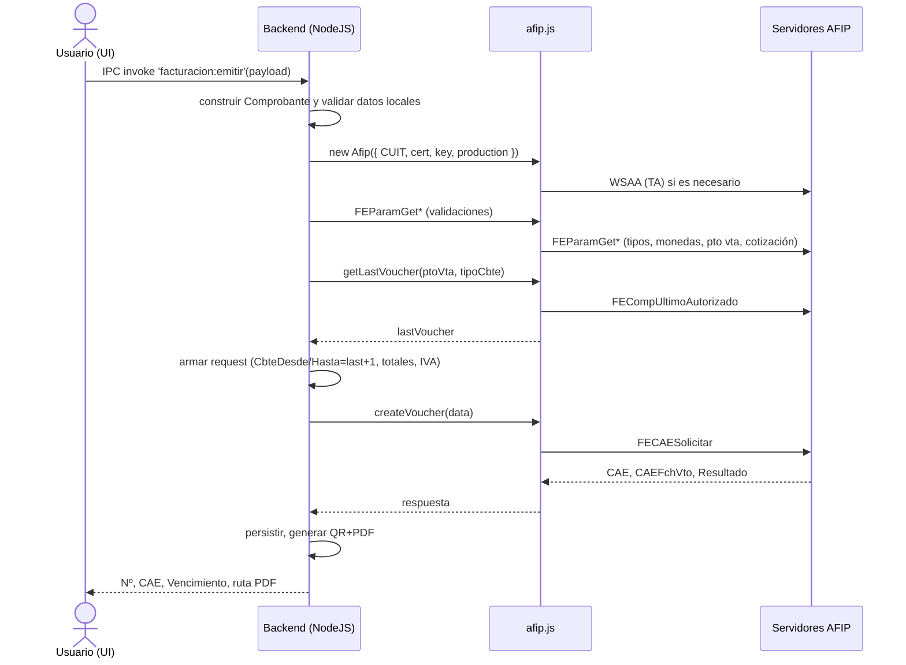

## Informe Técnico: Módulo de Facturación (Electron + Node.js + afip.ts local)

### 1. Arquitectura General y Componentes

- **Interfaz de Usuario (Frontend - Electron)**: captura los datos del comprobante, invoca la emisión a través de IPC y muestra el resultado (Nº, CAE, vencimiento, PDF y QR). API expuesta en `preload`:

```117:145:src/preload.ts
// ...
facturacion: {
  guardarConfig: (cfg: any) => ipcRenderer.invoke('facturacion:guardar-config', cfg),
  emitir: (payload: any) => ipcRenderer.invoke('facturacion:emitir', payload),
  listar: (filtros?: { desde?: string; hasta?: string }) => ipcRenderer.invoke('facturacion:listar', filtros || {}),
  abrirPdf: (filePath: string) => ipcRenderer.invoke('facturacion:abrir-pdf', filePath),
  empresaGet: () => ipcRenderer.invoke('facturacion:empresa:get'),
  empresaSave: (data: any) => ipcRenderer.invoke('facturacion:empresa:save', data),
  paramGet: () => ipcRenderer.invoke('facturacion:param:get'),
  paramSave: (data: any) => ipcRenderer.invoke('facturacion:param:save', data),
  listarPdfs: () => ipcRenderer.invoke('facturacion:pdfs'),
  // Validación de CAE
  validateCAE: (facturaId: number, operation: string) => ipcRenderer.invoke('facturacion:validate-cae', { facturaId, operation }),
  validateCAEComprobante: (numero: number, ptoVta: number, tipoCbte: number, operation: string) => ipcRenderer.invoke('facturacion:validate-cae-comprobante', { numero, ptoVta, tipoCbte, operation }),
  getCAEStatus: (facturaId: number) => ipcRenderer.invoke('facturacion:get-cae-status', { facturaId }),
  getCAEStatusComprobante: (numero: number, ptoVta: number, tipoCbte: number) => ipcRenderer.invoke('facturacion:get-cae-status-comprobante', { numero, ptoVta, tipoCbte }),
  findExpiringCAE: (warningThresholdHours?: number) => ipcRenderer.invoke('facturacion:find-expiring-cae', { warningThresholdHours }),
  findExpiredCAE: () => ipcRenderer.invoke('facturacion:find-expired-cae'),
  // Emisión con provincias
  emitirConProvincias: (payload: any) => ipcRenderer.invoke('facturacion:emitir-con-provincias', payload)
}
```

- **Lógica de Negocio (Backend - NodeJS)**: maneja IPC en el proceso principal, orquesta la emisión, genera PDF, persiste y devuelve resultados. Handler principal de emisión:

```1106:1135:src/main.ts
// IPC Facturación
ipcMain.handle('facturacion:emitir', async (_e, payload: any) => {
  try {
    const res = await getFacturacionService().emitirFacturaYGenerarPdf(payload);
    return { ok: true, ...res };
  } catch (e: any) {
    return { ok: false, error: String(e?.message || e) };
  }
});
```

- **Conector AFIP (adapter local)**: Se utiliza un adapter `CompatAfip` sobre el SDK local `sdk/afip.ts-main` para WSAA/WSFE (ElectronicBilling). Instanciación y uso de `getLastVoucher`/`createVoucher`:

```176:266:src/modules/facturacion/afipService.ts
// Validación FEParamGet*
const validationResult = await validator.validateComprobante(validationParams);
// Obtener último autorizado
const last = await this.resilienceWrapper.execute(
  () => afip.ElectronicBilling.getLastVoucher(ptoVta, tipoCbte),
  'getLastVoucher'
) as any;
// Crear comprobante
const response = await this.resilienceWrapper.execute(
  () => afip.ElectronicBilling.createVoucher(request),
  'createVoucher'
) as any;
```

- **Web Services de AFIP**: 
  - WSAA (autenticación y Ticket de Acceso, TA). La librería maneja la vigencia y renovación del `TA.xml` automáticamente con las credenciales provistas.
  - WSFE (Facturación Electrónica): operaciones paramétricas y transaccionales (getVoucherTypes, getLastVoucher, createVoucher, etc.).

Diagrama de componentes (Mermaid):

```mermaid
flowchart LR
  UI["Electron UI<br/>Formulario de factura"] -->|IPC invoke 'facturacion:emitir'| BE["Proceso Principal NodeJS<br/>FacturacionService"]
  BE -->|orquesta| AFIPSRV["AfipService"]
  AFIPSRV -->|Adapter| ADP["CompatAfip (afip.ts local)"]
  ADP -->|WSAA/WSFE| AFIP["Servidores AFIP"]
  BE -->|PDF/DB| PERS["Persistencia + PDF"]
  BE -->|resultado (Nº, CAE, venc)| UI
```

### 2. Flujo Detallado para la Creación de un Comprobante

1) **Captura de Datos (UI Electron)**: el usuario completa el formulario y dispara la emisión. La UI invoca `window.api.facturacion.emitir(payload)` expuesto por `preload`.

2) **Invocación al Backend (IPC)**: en `main.ts` se maneja el canal `facturacion:emitir`, que deriva a `FacturacionService.emitirFacturaYGenerarPdf`.

```1106:1115:src/main.ts
ipcMain.handle('facturacion:emitir', async (_e, payload: any) => {
  const res = await getFacturacionService().emitirFacturaYGenerarPdf(payload);
  return { ok: true, ...res };
});
```

3) **Instanciación y Autenticación**: `AfipService.getAfipInstance()` construye `new Afip({ CUIT, production, cert, key })` con la configuración de `DbService` y valida tiempo NTP y certificado. El SDK gestiona WSAA (TA) internamente.

```84:93:src/modules/facturacion/afipService.ts
const Afip = loadAfip();
this.afipInstance = new Afip({
  CUIT: Number(cfg.cuit),
  production: cfg.entorno === 'produccion',
  cert: cfg.cert_path,
  key: cfg.key_path
});
```

Parámetros clave `options`:
- **CUIT**: CUIT del emisor.
- **cert** y **key**: rutas a certificado y clave privada.
- **production**: booleano para cambiar entre homologación/producción.

4) **Obtención de Datos Previos**: se consulta el último número autorizado con `getLastVoucher(ptoVta, tipoCbte)` tras validar parámetros con FEParamGet*.

```178:186:src/modules/facturacion/afipService.ts
const last = await this.resilienceWrapper.execute(
  () => afip.ElectronicBilling.getLastVoucher(ptoVta, tipoCbte),
  'getLastVoucher'
) as any;
const numero = Number(last) + 1;
```

5) **Armado del Payload de la Factura**: `AfipService` construye el objeto `request` conforme WSFE:

```235:255:src/modules/facturacion/afipService.ts
const request = {
  CantReg: 1,
  PtoVta: ptoVta,
  CbteTipo: tipoCbte,
  Concepto: comprobante.concepto || 1,
  DocTipo: comprobante.docTipo || 99,
  DocNro: comprobante.cliente?.cuit ? Number(comprobante.cliente.cuit) : 0,
  CbteDesde: numero,
  CbteHasta: numero,
  CbteFch: comprobante.fecha,
  ImpTotal: AfipHelpers.formatNumber(comprobante.totales.total),
  ImpTotConc: 0,
  ImpNeto: AfipHelpers.formatNumber(comprobante.totales.neto),
  ImpOpEx: 0,
  ImpIVA: AfipHelpers.formatNumber(comprobante.totales.iva),
  ImpTrib: 0,
  MonId: comprobante.monId || 'PES',
  MonCotiz: 1,
  Iva: AfipHelpers.buildIvaArray(comprobante.items)
};
```

Campos principales según AFIP:
- **CantReg**: cantidad de registros (siempre 1).
- **PtoVta**, **CbteTipo**.
- **Concepto**: 1=Productos, 2=Servicios, 3=Productos y Servicios.
- **DocTipo/DocNro** del receptor (80=CUIT, 96=DNI, 99=Consumidor Final).
- **CbteDesde/Hasta**, **CbteFch** (YYYYMMDD).
- **ImpTotal**, **ImpNeto**, **ImpIVA**, **ImpTotConc**, **ImpOpEx**, **ImpTrib**.
- **MonId** (por ej. PES) y **MonCotiz**.
- **Iva**: arreglo de alícuotas con `{ Id, BaseImp, Importe }`.

6) **Solicitud de Autorización (CAE)**: se invoca `afip.ElectronicBilling.createVoucher(request)`; se aplican mecanismos de resiliencia y control de idempotencia.

```257:265:src/modules/facturacion/afipService.ts
const response = await this.resilienceWrapper.execute(
  () => afip.ElectronicBilling.createVoucher(request),
  'createVoucher'
) as any;
const cae = response.CAE; const caeVto = response.CAEFchVto;
```

7) **Procesamiento de la Respuesta**:
- Éxito: se marca idempotencia como aprobada, se construye QR y se retorna `{ cae, vencimientoCAE, qrData }`.
- Errores: se registran, se marca idempotencia fallida si corresponde y se lanza `Error` con detalle. También se generan warnings de validación FEParamGet* si aplica.

```263:281:src/modules/facturacion/afipService.ts
await this.idempotencyManager.markAsApproved(ptoVta, tipoCbte, numero, cae, caeVto);
const qrData = AfipHelpers.buildQrUrl({ cuit: Number(cfg.cuit), ptoVta, tipoCmp: tipoCbte, nroCmp: numero, importe: comprobante.totales.total, fecha: comprobante.fecha, cae });
return { cae, vencimientoCAE: caeVto, qrData };
```

8) **Finalización (Backend → UI)**: `FacturacionService` genera PDF, guarda en DB y retorna al handler IPC, que responde a la UI.

```119:151:src/services/FacturacionService.ts
const pdfPath = await getFacturaGenerator().generarPdf(...);
db.insertFacturaEmitida({ numero, /* ... */ cae, cae_vencimiento: cae_venc, qr_url: qrUrl, pdf_path: pdfPath });
return { numero, cae, cae_vencimiento: cae_venc, qr_url: qrUrl, pdf_path: pdfPath };
```

### 3. Interacción de Clases y Funciones Clave

- **Clase `Afip` (SDK @afipsdk/afip.js)**: punto de entrada, configurado con `{ CUIT, production, cert, key }`. Maneja WSAA (obtención y renovación del TA) y provee módulos como `ElectronicBilling` (WSFE).

- **Módulo WSAA (SDK)**: administra el `TA.xml` con vigencia temporal. La obtención/renovación del TA es automática al invocar métodos del SDK con credenciales válidas.

- **Módulo WSFE (SDK → `ElectronicBilling`)**:
  - `getLastVoucher(ptoVta: number, tipoCbte: number)`: devuelve último número autorizado; se suma 1 para `CbteDesde/ Hasta`.
  - `createVoucher(data: Voucher)`: envía el comprobante y retorna, entre otros, `CAE` y `CAEFchVto`.
  - Funciones paramétricas usadas en validación: `getVoucherTypes()`, `getConceptTypes()`, `getDocumentTypes()`, `getCurrenciesTypes()`, `getPointsOfSales()`, `getAliquotsTypes()`, `getCurrencyCotization(monId)`.

- **Clases propias**:
  - `AfipService`: orquesta validaciones locales y con AFIP, idempotencia, resiliencia, construcción de payload, llamado a WSFE y retorno. Puntos destacados:
    - Validación NTP y certificado.
    - Validación con FEParamGet* vía `AfipValidator`.
    - `getLastVoucher` → cálculo de número siguiente.
    - `createVoucher` → recepción de `CAE`/`CAEFchVto`.
    - Control de idempotencia y armado de QR.
  - `AfipValidator`: usa métodos FEParamGet* del SDK para validar `cbteTipo`, `concepto`, `docTipo`, `monId`, `ptoVta`, `cotización` (si aplica) y tipos de IVA.
  - `FacturacionService`: conversión de parámetros de UI a `Comprobante`, solicitud de CAE a `AfipService`, generación de QR y PDF, persistencia.

### 4. Diagrama de Secuencia (Mermaid)



—

Este documento describe el flujo “happy path” y controles adicionales (validación NTP/certificado, FEParamGet*, resiliencia e idempotencia) implementados en el proyecto, y sirve como base para auditorías y mantenimiento futuro.


