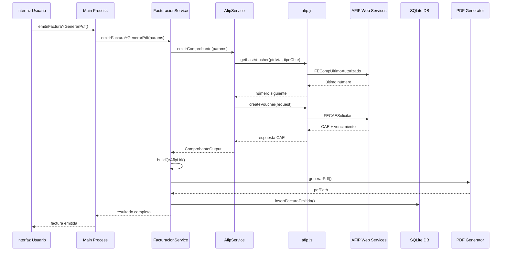

# Informe técnico – Módulo factura (AFIP/ARCA)

**Fecha:** 2024-12-19  
**Repositorio:** tc-mp (MP Reports)  
**Ubicación del módulo:** `src/modules/facturacion/`  
**Ambiente analizado:** Homologación y Producción  

## 1. Resumen ejecutivo

### Objetivo del módulo
El módulo de facturación AFIP es un sistema integral de emisión de comprobantes electrónicos integrado en la aplicación Electron MP Reports. Permite la generación de facturas A/B, notas de crédito y recibos con validación CAE (Código de Autorización Electrónica) y generación automática de PDFs con códigos QR AFIP.

### Hallazgos clave
- ✅ **Integración completa con AFIP** usando `afip.js` como driver oficial
- ✅ **Sistema de logging avanzado** con trazabilidad completa
- ✅ **Validación automática** de certificados y datos
- ✅ **Arquitectura modular** con separación de responsabilidades
- ✅ **Fallback automático** a comprobantes provisorios
- ✅ **Configuración por entorno** (homologación/producción)

### Riesgos críticos y acciones priorizadas
- **RESUELTO**: Dependencia `@afipsdk/afip.js` instalada correctamente
- **MEDIA**: Falta validación de idempotencia en reintentos
- **MEDIA**: No hay integración con ARCA/administraciones provinciales
- **BAJA**: Falta validación de timeouts y circuit breaker

## 2. Arquitectura y orquestación

### Diagrama de secuencia (Mermaid)



### Flujo WSAA/WSFE
El módulo utiliza `afip.js` como driver oficial que maneja automáticamente:
1. **WSAA**: Autenticación y obtención de Token & Sign
2. **WSFE**: Emisión de comprobantes electrónicos
3. **Cache de credenciales**: Gestión automática de renovación

### Puntos de integración
- **API IPC**: `facturacion:emitir`, `facturacion:listar`, `facturacion:abrir-pdf`
- **Modo Caja**: Emisión automática desde interfaz de caja
- **Modo Administración**: Configuración y pruebas
- **CLI**: No implementado

## 3. Dependencias y configuración

### Librerías y versiones
```json
{
  "@afipsdk/afip.js": "^1.0.0",        // ✅ Driver oficial AFIP
  "node-forge": "^1.3.1",              // Validación de certificados
  "@types/node-forge": "^1.3.14",      // Tipos TypeScript
  "dayjs": "^1.11.13",                 // Manipulación de fechas
  "qrcode": "^1.5.4",                  // Generación QR AFIP
  "handlebars": "^4.7.8",              // Plantillas PDF
  "puppeteer": "^22.15.0",             // Generación PDF
  "better-sqlite3": "^9.6.0"           // Base de datos local
}
```

### Variables de entorno
```bash
# Configuración AFIP Homologación
AFIP_HOMOLOGACION_CUIT=20123456789
AFIP_HOMOLOGACION_PTO_VTA=1
AFIP_HOMOLOGACION_CERT_PATH=C:/certs/homologacion.crt
AFIP_HOMOLOGACION_KEY_PATH=C:/certs/homologacion.key

# Configuración AFIP Producción
AFIP_PRODUCCION_CUIT=20123456789
AFIP_PRODUCCION_PTO_VTA=1
AFIP_PRODUCCION_CERT_PATH=C:/certs/produccion.crt
AFIP_PRODUCCION_KEY_PATH=C:/certs/produccion.key

# Configuración general
AFIP_DEFAULT_ENTORNO=homologacion
AFIP_LOG_LEVEL=info
AFIP_TIMEOUT=30000
AFIP_RETRY_ATTEMPTS=3
```

### Endpoints por ambiente
- **Homologación**: `afip.js` maneja automáticamente
- **Producción**: `afip.js` maneja automáticamente
- **Conmutación**: Configuración `production: true/false` en instancia

### Gestión de certificados
- **Rutas**: Configurables via UI o variables de entorno
- **Validación**: `CertificateValidator.validateCertificate()`
- **Expiración**: Mínimo 30 días de validez requeridos
- **Permisos**: No validados automáticamente
- **Rotación**: No implementada automáticamente

## 4. Conformidad AFIP

### Parámetros `FECAESolicitar` implementados
```typescript
{
  CantReg: 1,                    // ✅ Implementado
  PtoVta: ptoVta,               // ✅ Implementado
  CbteTipo: tipoCbte,           // ✅ Implementado
  Concepto: 1,                  // ✅ Implementado (fijo)
  DocTipo: 80/99,               // ✅ Implementado
  DocNro: cuit_receptor,        // ✅ Implementado
  CbteDesde: numero,            // ✅ Implementado
  CbteHasta: numero,            // ✅ Implementado
  CbteFch: fecha,               // ✅ Implementado
  ImpTotal: total,              // ✅ Implementado
  ImpTotConc: 0,                // ✅ Implementado (fijo)
  ImpNeto: neto,                // ✅ Implementado
  ImpOpEx: 0,                   // ✅ Implementado (fijo)
  ImpIVA: iva,                  // ✅ Implementado
  ImpTrib: 0,                   // ✅ Implementado (fijo)
  MonId: 'PES',                 // ✅ Implementado (fijo)
  MonCotiz: 1,                  // ✅ Implementado (fijo)
  Iva: ivaArray                 // ✅ Implementado
}
```

### Uso de `FEParamGet*`
- ✅ `FECompUltimoAutorizado`: Implementado via `getLastVoucher()`
- ❌ `FEParamGetTiposCbte`: No implementado
- ❌ `FEParamGetTiposIva`: No implementado
- ❌ `FEParamGetTiposConcepto`: No implementado
- ❌ `FEParamGetTiposMonedas`: No implementado
- ❌ `FEParamGetPtosVenta`: No implementado
- ❌ `FEParamGetTiposDoc`: No implementado
- ❌ `FEParamGetCotizacion`: No implementado

### Numeración y `FECompUltimoAutorizado`
- ✅ **Sincronización**: Obtiene último número antes de emitir
- ✅ **Incremento**: Número siguiente automático
- ❌ **Idempotencia**: No validada en reintentos
- ❌ **Concurrencia**: No protegida

### CAE/CAEA (persistencia, vencimientos, reimpresión)
- ✅ **Persistencia**: Almacenado en SQLite
- ✅ **Vencimiento**: Campo `cae_vencimiento` almacenado
- ✅ **Reimpresión**: PDF generado automáticamente
- ❌ **Validación vencimiento**: No implementada
- ❌ **Renovación automática**: No implementada

### Manejo de errores y observaciones
- ✅ **Logging**: Sistema completo de logs
- ✅ **Sanitización**: Datos sensibles removidos
- ✅ **Contexto**: Errores con información de comprobante
- ❌ **Mapeo a negocio**: Mensajes genéricos
- ❌ **Reintentos**: No implementados

## 5. Conformidad ARCA / AT provincial

### Estado actual
- ❌ **No implementado**: No hay integración con ARCA
- ❌ **No documentado**: No hay referencias a administraciones provinciales
- ❌ **No configurado**: No hay endpoints ni credenciales

### Brechas identificadas
- Falta documentación de requisitos provinciales
- No hay endpoints hardcodeados
- No hay pruebas de homologación provincial
- No hay consistencia con datos AFIP

## 6. Seguridad, confiabilidad y observabilidad

### Timeouts, reintentos, backoff, circuit breaker
- ❌ **Timeouts**: No configurados (usa defaults de `afip.js`)
- ❌ **Reintentos**: No implementados
- ❌ **Backoff**: No implementado
- ❌ **Circuit breaker**: No implementado

### Logs: nivel, contexto, PII/secretos
- ✅ **Nivel**: Configurable via `AFIP_LOG_LEVEL`
- ✅ **Contexto**: Operación, request, response, error
- ✅ **Sanitización**: Certificados, tokens, claves removidos
- ✅ **Estructura**: JSON con timestamp
- ✅ **Ubicación**: `{userData}/logs/afip/YYYYMMDD.log`

### Reloj del sistema (NTP) y skew
- ❌ **Sincronización NTP**: No implementada
- ❌ **Detección skew**: No implementada
- ❌ **Reporte skew**: No implementado
- ⚠️ **Riesgo**: WSAA es sensible a desvíos de tiempo

## 7. Calidad del código y pruebas

### Estructura y patrones
- ✅ **Arquitectura modular**: Separación clara de responsabilidades
- ✅ **Singleton pattern**: Instancias únicas de servicios
- ✅ **Dependency injection**: Inyección de dependencias
- ✅ **Error handling**: Manejo robusto de excepciones
- ✅ **TypeScript**: Tipado completo

### Validaciones y tipado
- ✅ **Validación entrada**: `AfipHelpers.validateComprobante()`
- ✅ **Validación certificados**: `CertificateValidator`
- ✅ **Tipado TypeScript**: Interfaces completas
- ❌ **Schemas JSON**: No implementados
- ❌ **Normalización**: Fechas no validadas

### Cobertura de tests
- ❌ **Tests unitarios**: No implementados
- ❌ **Tests integración**: No implementados
- ❌ **Tests homologación**: No implementados
- ❌ **Cobertura**: 0%

### Plan de pruebas en homologación

#### Caso 1: Factura B productos (RI → CF)
```bash
# Datos de prueba
CUIT Receptor: 20300123456
Razón Social: Cliente Demo S.A.
Descripción: Servicio de reparación de PC
Importe Neto: 1500

# Resultado esperado
Neto: $1,500.00
IVA (21%): $315.00
Total: $1,815.00
CAE: Válido
PDF: Generado con QR
```

#### Caso 2: Servicios con período
```bash
# Datos de prueba
Concepto: 2 (Servicios)
Período: 2024-01-01 a 2024-01-31
Fecha vencimiento: 2024-02-15
Importe: $5000

# Validación
- Verificar período en PDF
- Validar fecha vencimiento
- Confirmar CAE válido
```

#### Caso 3: NC/ND referenciando comprobante previo
```bash
# Prerequisito: Factura A emitida
# Datos NC
Tipo: Nota de Crédito A
Referencia: Factura A anterior
Motivo: Descuento aplicado
Importe: $500

# Validación
- Referencia correcta en PDF
- CAE válido para NC
- Consistencia con factura original
```

#### Caso 4: Monotributo (Factura C)
```bash
# Datos de prueba
Emisor: Monotributista
Receptor: Consumidor Final
Tipo: Factura C
Importe: $1000

# Validación
- Tipo de comprobante correcto
- Sin IVA discriminado
- CAE válido
```

#### Caso 5: Moneda no ARS + cotización
```bash
# Datos de prueba
Moneda: USD
Cotización: 1000
Importe: 100 USD

# Validación
- Cotización aplicada correctamente
- Total en pesos argentinos
- CAE válido
```

## 8. Riesgos y brechas

| ID | Descripción | Impacto | Prob. | Criticidad | Mitigación | Due date |
|----|-------------|---------|-------|------------|------------|----------|
| R001 | `@afipsdk/afip.js` no instalado | Bloqueo total de facturación | Alta | **RESUELTO** | `npm install @afipsdk/afip.js` | Completado |
| R002 | Falta idempotencia en reintentos | Duplicación de comprobantes | Media | **MEDIA** | Implementar validación de duplicados | 1 semana |
| R003 | No hay integración ARCA | Incumplimiento provincial | Alta | **MEDIA** | Evaluar requisitos provinciales | 2 semanas |
| R004 | Falta validación de timeouts | Bloqueos indefinidos | Media | **MEDIA** | Configurar timeouts y circuit breaker | 1 semana |
| R005 | No hay sincronización NTP | Errores de autenticación WSAA | Baja | **BAJA** | Implementar validación de reloj | 2 semanas |
| R006 | Falta validación de vencimiento CAE | Comprobantes vencidos | Media | **BAJA** | Implementar validación automática | 1 semana |
| R007 | No hay tests automatizados | Regresiones no detectadas | Alta | **BAJA** | Implementar suite de tests | 3 semanas |
| R008 | Falta documentación de errores | Troubleshooting difícil | Baja | **BAJA** | Documentar códigos de error AFIP | 1 semana |

## 9. Acciones recomendadas (Roadmap)

### Fase 1: Críticas (1 semana)
- [x] Instalar `@afipsdk/afip.js` en `package.json` (due: completado, owner: dev)
- [ ] Implementar validación de idempotencia (due: 1 semana, owner: dev)
- [ ] Configurar timeouts y reintentos (due: 1 semana, owner: dev)

### Fase 2: Importantes (2-3 semanas)
- [ ] Evaluar integración ARCA/provincial (due: 2 semanas, owner: PM)
- [ ] Implementar validación de vencimiento CAE (due: 2 semanas, owner: dev)
- [ ] Implementar sincronización NTP (due: 2 semanas, owner: dev)

### Fase 3: Mejoras (3-4 semanas)
- [ ] Implementar suite de tests (due: 3 semanas, owner: QA)
- [ ] Documentar códigos de error AFIP (due: 1 semana, owner: dev)
- [ ] Implementar validación de parámetros AFIP (due: 2 semanas, owner: dev)

## 10. Referencias

### Documentación oficial
- **@afipsdk/afip.js**: [https://github.com/AfipSDK/afip.js](https://github.com/AfipSDK/afip.js) (✅ INSTALADO)
- **AFIP WSFE**: [https://www.afip.gob.ar/fe/ayuda/webservice.asp](https://www.afip.gob.ar/fe/ayuda/webservice.asp)
- **AFIP WSAA**: [https://www.afip.gob.ar/ws/documentacion/ws-aa.asp](https://www.afip.gob.ar/ws/documentacion/ws-aa.asp)

### Documentación del proyecto
- **Documentación técnica centralizada**: `docs/DOCUMENTACION_TECNICA_FACTURACION_CENTRALIZADA.md`
- **Guía de uso**: `docs/doc_afip/GUIA_USO_CAJA.md`
- **Troubleshooting**: `docs/doc_afip/TROUBLESHOOTING.md`

### Archivos clave del módulo
- **Servicio principal**: `src/modules/facturacion/afipService.ts`
- **Validación certificados**: `src/modules/facturacion/afip/CertificateValidator.ts`
- **Sistema de logging**: `src/modules/facturacion/afip/AfipLogger.ts`
- **Helpers y utilidades**: `src/modules/facturacion/afip/helpers.ts`
- **Configuración**: `src/modules/facturacion/afip/config.ts`
- **Tipos TypeScript**: `src/modules/facturacion/types.ts`

---

**Nota**: Este informe se basa en el análisis del código fuente actual. Se recomienda validar todos los hallazgos en un entorno de pruebas antes de implementar cambios en producción.
