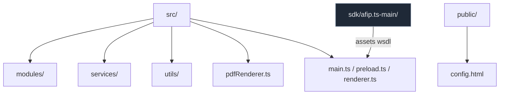
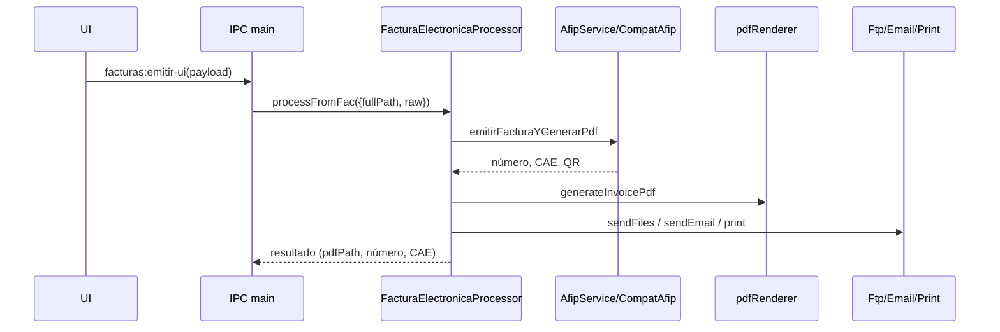

# Auditoría de Arquitectura de Código – Tc‑Mp

Fecha: 19/09/2025

## Alcance y objetivos
- Identificar código y dependencias potencialmente obsoletas o duplicadas.
- Mapear componentes principales y sus relaciones.
- Proveer una base segura para una depuración y limpieza progresiva (sin eliminar nada aún).

## Resumen ejecutivo
- Se unificó el flujo de emisión de Facturas/Notas (UI y .fac) en `FacturaElectronicaProcessor`.
- Se retiró el legado de Factura A (archivo, IPCs y API expuesta).
- Se confirmaron dependencias efectivamente usadas y se listaron candidatas a remoción controlada.
- Se documentaron rutas de salida, nombres de archivos, `.res`, fondos/fuentes y diagnóstico en `.exe`.
- Se añadieron recomendaciones para una limpieza sin riesgo y chequeos de CI.

## Estructura de carpetas (alto nivel)


### Módulos y servicios principales
```mermaid
flowchart LR
  subgraph Facturacion
    FP[FacturaElectronicaProcessor]
    FR[facProcessor (Recibo)]
    RM[remitoProcessor]
    FA[AfipService]
    CA[CompatAfip]
    PR[pdfRenderer]
  end
  subgraph IO
    FS[FtpService]
    EM[EmailService]
    PT[PrintService]
  end
  FP --> FA --> CA
  FP --> PR
  FP --> FS
  FP --> EM
  FP --> PT
  FR --> PR
  FR --> FS
  FR --> EM
  FR --> PT
  RM --> PR
  RM --> FS
  RM --> EM
  RM --> PT
```

## Servicios principales y dependencias
- Facturación unificada
  - `src/modules/facturacion/FacturaElectronicaProcessor.ts`
  - Usa: `FacturacionService`/`AfipService` → `CompatAfip`, `pdfRenderer.ts`, `FtpService`, `EmailService`, `PrintService`.
- Recibo
  - `src/modules/facturacion/facProcessor.ts`
- Remito
  - `src/modules/facturacion/remitoProcessor.ts`
- AFIP
  - `src/services/AfipService.ts`, adaptador `CompatAfip`, assets WSDL en `sdk/afip.ts-main` (incluidos vía electron‑builder extraResources).
- PDF/Render
  - `src/pdfRenderer.ts`, layout `src/invoiceLayout.mendoza.ts`.
- IO/Comunicaciones
  - FTP/WhatsApp/MP: `src/services/FtpService.ts`.
  - Email: `src/services/EmailService.ts`.
  - Impresión: `src/services/PrintService.ts`.

## Elementos obsoletos/duplicados detectados

| Ruta | Razón | Alternativa en uso | Acción sugerida |
|---|---|---|---|
| `src/modules/facturacion/facturaAProcessor.ts` | Flujo legado para Factura A; UI y .fac migrados al pipeline unificado | `src/modules/facturacion/FacturaElectronicaProcessor.ts` | Eliminado ya en rama actual (limpieza aplicada) |
| IPC `facturaA:get-config/save-config` en `src/main.ts` | Config legacy separada | `facturas:get-config/save-config` | Removidos (UI usa unificado) |
| `window.api.facturaA` en `src/preload.ts` | API expuesta para legacy | `window.api.facturas` | Removido |

Nota: Mantener verificación continua de referencias en UI tras cada build.

## Dependencias de package.json – revisión de uso
### Tabla de dependencias y evidencias
| Dependencia | Estado | Evidencia (archivo) | Notas |
|---|---|---|---|
| basic-ftp | En uso | `src/services/FtpService.ts` | FTP cliente general |
| ssh2-sftp-client | En uso | `src/services/FtpService.ts` | Canal WhatsApp (SFTP) |
| electron-store | En uso | `src/services/ReportService.ts` | Persistencia segura (settings) |
| pdfkit | En uso | `src/pdfRenderer.ts` | Render PDF principal |
| qrcode | En uso | `src/pdfRenderer.ts` | QR en PDF |
| better-sqlite3 | En uso | `src/services/DbService.ts` | Base local |
| axios | En uso | `src/services/GaliciaService.ts`, `src/modules/facturacion/arca/ArcaClient.ts` | HTTP |
| winston | En uso | varios servicios | Logging |
| xml2js | En uso | servicios AFIP | XML/WSDL auxiliares |
| dbffile | En uso | `src/services/ReportService.ts` | Generación DBF detallado |
| ftp-srv | En uso | `src/services/FtpServerService.ts` | Servidor FTP local |
| nodemailer | En uso | `src/services/EmailService.ts` | Email |
| dayjs | En uso | varios (PDF, reportes) | Fechas (reemplaza moment) |
| mercadopago | En uso | `src/services/MercadoPagoService.ts` | API MP |
| exceljs | En uso | `src/services/ReportService.ts` | XLSX |
| pdf-to-printer | En uso | `src/services/PrintService.ts` | Impresión |
| papaparse | En uso | `src/services/ReportService.ts` | CSV |
| puppeteer | En uso | `src/services/FacturaGenerator.ts` | Render HTML→PDF alternativo |
| handlebars | En uso | `src/services/FacturaGenerator.ts` | Plantillas HTML |
| ntp-client | En uso | `src/modules/facturacion/utils/TimeValidator.ts` | Validación NTP |
| node-forge | En uso | `src/modules/facturacion/afip/CertificateValidator.ts` | Certificados |
| argon2 | En uso | `src/services/AuthService.ts` | Hashing de contraseñas |
| jimp | No hallado | — | Revisión manual/retirable si no hay uso indirecto |
| moment | No hallado | — | Revisión; `dayjs` es estándar actual |
| opossum | No hallado | — | Revisión; si no hay uso de circuit breaker, retirar |
- Confirmadas en uso (import/require detectados o por contexto de servicio):
  - `basic-ftp`, `ssh2-sftp-client`, `electron-store`, `pdfkit`, `qrcode`, `better-sqlite3`, `axios`, `winston`, `xml2js`, `dbffile`, `ftp-srv`, `nodemailer`, `dayjs`, `mercadopago`, `exceljs`, `pdf-to-printer`.
- Evidencias específicas encontradas:
  - `papaparse`: importado en `src/services/ReportService.ts` (CSV). En uso.
  - `puppeteer`: requerido en `src/services/FacturaGenerator.ts` (render HTML→PDF de plantillas). En uso dev/alternativo.
  - `handlebars`: requerido en `src/services/FacturaGenerator.ts`. En uso para plantillas HTML.
  - `ntp-client`: en uso en `src/modules/facturacion/utils/TimeValidator.ts` (validación de hora NTP).
  - `node-forge`: en uso en `src/modules/facturacion/afip/CertificateValidator.ts` (validación de certificados).
  - `argon2`: import directo en `src/services/AuthService.ts`. En uso.
  - `opossum`: import no encontrado (revisión manual).
  - `jimp`: import no encontrado (revisión manual).
  - `moment`: import no encontrado (se usa `dayjs`).

Sugerencia: confirmar con grep/telemetría y una corrida de pruebas antes de proponer remoción.

## Archivos posiblemente no usados o sustituidos
- `src/renderExample.ts`, `src/calibrate.ts`
  - Utilidades de desarrollo (scripts `pdf:example`, `pdf:calibrate`). Mantener para QA; marcar “solo dev”.
- `src/modules/facturacion/padron.ts`
  - Verificar si flujo A13 ya centraliza en `A13FilesService` (en uso). Revisión manual.
 - `src/services/FacturaGenerator.ts`
  - Generación PDF por Puppeteer/Handlebars (alternativa a pdfkit). Decidir consolidación (en uso alternativo/QA).
 - `src/services/Provincia*` (`ProvinciaManager`, `ATMService`)
   - En uso en módulo provincial; mantener. Confirmado por imports en `src/modules/facturacion/provincia/*`.
 - Servicios generales presentes y en uso:
   - `GaliciaService`, `MercadoPagoService`, `FtpServerService`, `OtpService`, `ErrorNotificationService`, `AuthService`, `ReportService` (referenciados desde `src/main.ts` o UI/IPC).

## Duplicados/superposiciones lógicas
- Emisión UI y .fac → unificadas en `FacturaElectronicaProcessor`.
- Configuración consolidada en `facturas.config.json` (userData).

## Recomendaciones de limpieza segura (no ejecutar aún)
1. Confirmar no‑uso de `jimp`, `moment`, `papaparse`, `puppeteer`, `opossum`.
2. Marcar `renderExample.ts` y `calibrate.ts` como solo‑dev y, si corresponde, excluir de build final.
3. Actualizar documentación para evitar referencias al flujo legacy (`facturaAProcessor`).
4. Añadir chequeo CI (grep) para impedir re‑introducción de `facturaA:*`.
 5. Revisar consolidación entre `pdfRenderer.ts` y `FacturaGenerator.ts` para tener un único camino de render.
 6. Validar cobertura de pruebas para `TimeValidator` (NTP) y `CertificateValidator` (forge) en build .exe.

### Orden sugerido de retiro de dependencias (con PRs y verificación por build)
1) `moment` → no hallado en imports, confirmar en scripts externos. Si no hay uso, remover.
2) `jimp` → si no hay uso indirecto, remover y ajustar lockfile.
3) `opossum` → confirmar que no haya circuit‑breakers activos. Si no, remover.
4) Revaluar `FacturaGenerator` (puppeteer/handlebars): si se consolida en `pdfRenderer`, retirar dependencias asociadas.

### Referencias cruzadas de documentación
- Flujo unificado y detalles operativos: ver `documentacion_interna/facturacion/facturas.md`.

## Diagrama de interacción (emisión)


## Notas de diagnóstico en .exe
- WSDL en `resources/app/sdk/afip.ts-main/src/soap/wsdl`; tickets en `userData/afip/tickets`.
- Watcher `.fac` por defecto `C:\\tmp`.
- Fondos: buscar por nombre en `templates` del paquete si falla ruta absoluta.
- Fuentes: `pdf.config.json` en `userData/config` o Consolas empaquetadas.

---
Este informe no elimina código. Sirve como base para una limpieza futura con validaciones y pruebas de regresión.

Auditoría realizada por: GPT‑5 (Asistente técnico, análisis estático y mermaid)
Fecha y hora: 19/09/2025 17:00:00
