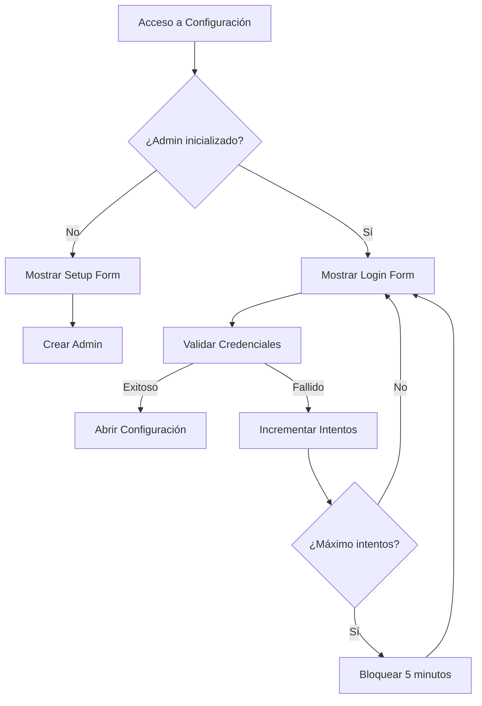
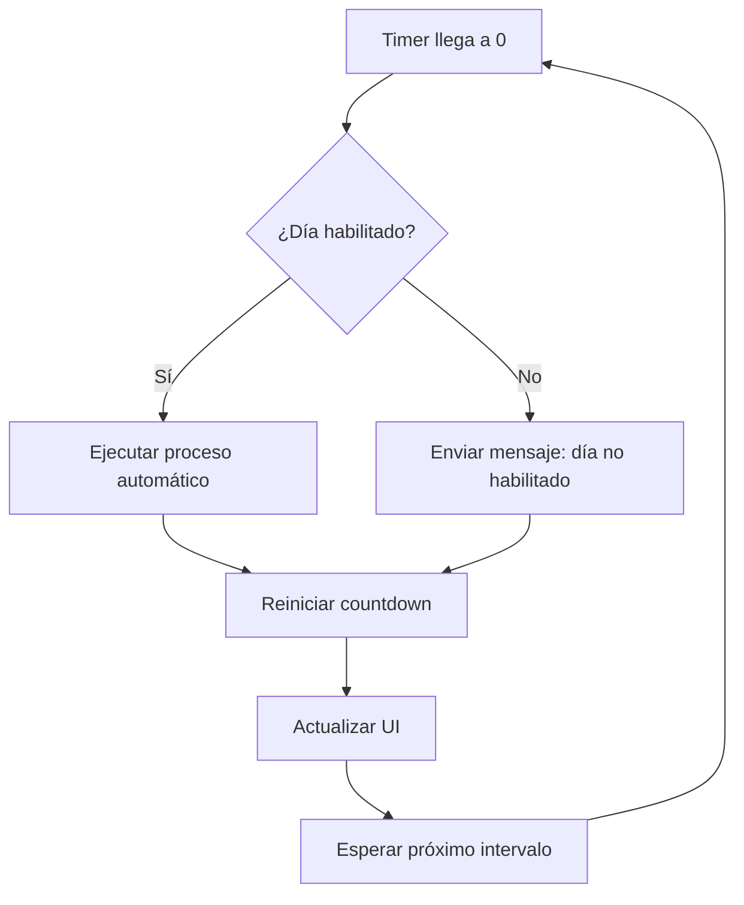

# INFORME TÉCNICO - PROYECTO MP (Mercado Pago Reports)

## RESUMEN EJECUTIVO

**Proyecto:** Sistema de Reportes de Pagos Mercado Pago  
**Versión:** 1.0.11  
**Tecnologías:** TypeScript + Electron + Node.js  
**Propósito:** Generación automatizada de reportes operativos de ventas desde Mercado Pago

---

## NOVEDADES 1.0.11 (Estado actual)

1) Modo Imagen – Publicidad (pantalla completa/kiosco)
- Ventana espejo (`VENTANA=comun12`) ahora soporta un modo de proyección “full full”.
- Implementación (Main): `setKiosk(true) + setFullScreen(true) + setAlwaysOnTop('screen-saver') + setVisibleOnAllWorkspaces(true)` cuando la opción “Publicidad” está activa (toggle en bandeja) y habilitada en Config (`IMAGE_PUBLICIDAD_ALLOWED`).
- Implementación (Renderer): si `publicidad=true`, el `<video>` solicita `requestFullscreen()`; CSS (`body.publicidad`) elimina marco/bordes y fuerza fondo negro.
- Menú de bandeja: item “Publicidad” con estado persistente; se refresca al guardar Config para reflejar `IMAGE_PUBLICIDAD_ALLOWED`.

2) `VENTANA=nueva` – Política “Producto nuevo” (anti‑saturación)
- Objetivo: evitar apertura masiva de ventanas cuando llegan muchos contenidos en ráfaga.
- Configuración en Admin → Modo Imagen: `IMAGE_PRODUCTO_NUEVO_ENABLED` (on/off) y `IMAGE_PRODUCTO_NUEVO_WAIT_SECONDS` (segundos de enfriamiento).
- Implementación (Main): se mantiene `lastImageNewWindow` y `lastImageNewWindowAt`. Si una nueva solicitud `VENTANA=nueva` llega dentro del intervalo, se reutiliza la última ventana y solo se envía `image:new-content` (no se crea otra).
- Persiste/restaura bounds; cierre con `ESC` permanece igual.

3) Reproductor y estabilidad del visor
- Videos: `autoplay + loop + muted + playsInline` por defecto.
- Al cambiar de contenido, se detiene/limpia cualquier `<video>/<audio>` previo para evitar solapamientos.
- Fallback: si falta `*.jpg` se intenta `*.mp4` y, si no existe, se usa `Noimage.jpg`/`nombre_tc.png`.

4) Integración de Configuración y UI
- `public/config.html`: agregado “Modo Publicidad” y controles de “Producto nuevo (enfriamiento VENTANA=nueva)”.
- Guardar Config ahora refresca el menú de bandeja para habilitar de inmediato el ítem “Publicidad”.

---

## NOVEDADES 1.0.10 (histórico)

1) Disparo inmediato por FTP (sin intervalo)
- Watchers en el proceso principal que reaccionan al instante cuando llegan archivos a la carpeta del Servidor FTP integrado.
- Remoto: procesa `mp*.txt` (requiere `MP_ACCESS_TOKEN`).
- Imagen: procesa el archivo de control (por defecto `direccion.txt`) con formato `URI@VENTANA@INFO`.
- Si el “disparo inmediato” está activo en Remoto e Imagen, el polling por intervalo se desactiva para evitar trabajo duplicado.

2) Modo Imagen (visor) ampliado
- Formato de control flexible: `URI=RUTA@VENTANA=comun|nueva|comun12@INFO=texto`.
- Modos de ventana: `comun`, `nueva` (nueva ventana con ESC para cerrar y bounds persistentes), `comun12` (principal + espejo persistente).
- Fallback visual si el recurso no existe; limpieza automática de `.txt` antiguos configurable.
- Soporta imágenes, PDF, audio y video. Rutas UNC y locales; web `http/https` se abre en el navegador si `VENTANA=nueva`.

3) FTP – Cliente y Servidor
- Servidor FTP integrado (ftp-srv): Host/Puerto/Usuario/Contraseña/Raíz y PASV opcional. Autoarranque.
- Envío manual de archivo desde Configuración: “Elegir archivo” + “Enviar archivo por FTP” (nuevo método `sendArbitraryFile`).
- Documentación y UI explicativa (tarjetas) para Remoto/Imagen con “Disparo inmediato”.

4) Manual autosuficiente
- `docs/manual.html` ahora contiene toda la documentación y diagramas embebidos (sin enlaces a archivos `.md`).
- Diagramas SVG: arquitectura y flujos (disparo inmediato vs. intervalo).

5) Notas
- Rutas UNC se usan tal cual llegan en `URI`. En logs JSON pueden verse con barras escapadas, sin afectar la ejecución.
- Los `.txt` de control se consumen y eliminan tras procesar; los medios no se copian ni se borran.

### ARQUITECTURA ACTUALIZADA (1.0.10)

- Proceso Principal (Electron Main)
  - Timers de automatización (global y remoto) y watchers de carpeta cuando “Disparo inmediato” está activo (`AUTO_REMOTE_WATCH`, `IMAGE_WATCH`).
  - FTP Server integrado (`ftp-srv`) con soporte PASV opcional; logging de login/conexiones/errores.
  - IPC segura: handlers para auto (`auto-*`), FTP (`ftp-server:*`, `ftp:send-file`), Imagen (`image:*`), licencia/autenticación.
  - Limpieza de artefactos: `.txt` de control tras procesar; limpieza programática de `.txt` antiguos en `IMAGE_CONTROL_DIR` según horas configuradas.

- Preload
  - Bridge expone funciones de lectura/escritura de configuración, auto, FTP (test y envío), Imagen (test control), utilidades (`open-path`), y autenticación (setup/login/cambio/OTP).

- Renderers (Caja/Config/Imagen)
  - Caja: UI operativa y feedback de auto-reporte.
  - Config: formularios de MP/FTP/Automatización/Seguridad/Errores con validaciones; nuevos toggles y botones para pruebas.
  - Imagen: visor minimalista y responsive; escucha `image:new-content` y ajusta título con `INFO`.

- Rutas y recursos
  - Rutas locales y UNC (no se normalizan). Web `http/https` se abre en navegador si `VENTANA=nueva`.
  - Los medios se leen “in situ” (no se copian); sólo se consume/elimina el `.txt` de control.

### DETALLE DE WATCHERS Y TIMERS

- Watchers (cuando están activos):
  - Remoto: observa `AUTO_REMOTE_DIR` y filtra `mp*.txt`; ejecuta flujo de reporte y elimina el disparador.
  - Imagen: observa `IMAGE_CONTROL_DIR` y el archivo `IMAGE_CONTROL_FILE`; procesa y elimina el `.txt`.
  - Mutex (`unifiedScanBusy`): evita carreras entre remoto e imagen.

- Timers:
  - Remoto unificado (prioridad): ejecuta remoto y, si no hay disparos, imagen; respeta días/horarios.
  - Imagen dedicado: inhabilitado en 1.0.10 (unificado por remoto) para simplificar.

### RIESGOS Y CONTROLES

- EPERM/EBUSY/EACCES al leer/borrar `.txt`: se reintenta en el siguiente evento/intervalo (no falla la app).
- Rutas UNC inaccesibles: fallback visual y logging; el `.txt` se consume para permitir nuevos disparos.
- Credenciales FTP inválidas: logging y rechazo de login; guía PASV y firewall documentada.
- MP sin Access Token: error amigable y guía al usuario; no aborta la app.

### ESTADO DE DOCUMENTACIÓN

- Manual (autosuficiente) con diagramas, glosario, FAQ y pruebas guiadas.
- Notas de versión 1.0.10 publicadas.
- Documentos internos actualizados: Configuración de FTP y Modo Imagen.

## ARQUITECTURA DEL SISTEMA

### 1. ESTRUCTURA GENERAL

El proyecto implementa una **arquitectura híbrida** con dos modos de operación:

#### 1.1 Aplicación de Escritorio (Electron)
- **Entrada:** `src/main.ts` - Proceso principal de Electron
- **Interfaz:** `public/` - Archivos HTML/CSS para GUI
- **Servicios:** `src/services/` - Lógica de negocio
- **Salida:** Archivos en `C:\2_mp\reportes\` o `Documentos/MP-Reportes/`

#### 1.2 CLI (Command Line Interface)
- **Entrada:** `mp-sdk/report.ts` - Script independiente
- **Servicios:** `mp-sdk/services/` - Lógica compartida
- **Salida:** Archivos en `out/` (carpeta temporal)

### 2. COMPONENTES PRINCIPALES

```
mp/
├── src/                    # Aplicación Electron
│   ├── main.ts            # Proceso principal
│   ├── preload.ts         # Bridge IPC
│   ├── renderer.ts        # Renderer process
│   ├── caja.ts           # Lógica de interfaz caja
│   └── services/         # Servicios de negocio
├── mp-sdk/               # CLI independiente
│   ├── report.ts         # Script principal CLI
│   └── services/         # Servicios compartidos
├── public/               # Interfaz de usuario
└── dist/                 # Código compilado
```

---

## FUNCIONALIDADES CORE

### 1. INTEGRACIÓN CON MERCADO PAGO

#### 1.1 Autenticación
- **Método:** Access Token de producción (`APP_USR-...`)
- **Configuración:** Variables de entorno o GUI
- **Seguridad:** Almacenamiento encriptado con `electron-store`

#### 1.2 Consulta de Pagos
- **API:** `payments/search` del SDK oficial
- **Filtros:** Fechas, estados, paginación
- **Campos:** Transacciones, devoluciones, comisiones

### 2. GENERACIÓN DE REPORTES

#### 2.1 Formatos de Salida
| Archivo | Descripción | Uso |
|---------|-------------|-----|
| `transactions-YYYY-MM-DD.csv` | CSV curado | Operaciones principales |
| `transactions-full-YYYY-MM-DD.csv` | CSV completo | Todos los campos aplanados |
| `transactions-full-YYYY-MM-DD.xlsx` | Excel | Tabla con filtros |
| `transactions-detailed-YYYY-MM-DD.dbf` | DBF | Compatible dBase |
| `balance-YYYY-MM-DD.json` | JSON | Resumen y totales |

#### 2.2 Procesamiento de Datos
```typescript
// Mapeo de transacciones
function mapDetailedRow(payment: any) {
    return {
        operation_id: payment.id,
        status: payment.status,
        transaction_amount: payment.transaction_amount,
        net_received_amount: payment.transaction_details?.net_received_amount,
        // ... +40 campos más
    };
}
```

### 3. CONFIGURACIÓN Y PERSONALIZACIÓN

#### 3.1 Variables de Entorno (.env)
```env
# Mercado Pago
MP_ACCESS_TOKEN=APP_USR_xxx
MP_USER_ID=me

# Filtros de fecha
MP_TZ=America/Argentina/Buenos_Aires
MP_DATE_FROM=YYYY-MM-DD
MP_DATE_TO=YYYY-MM-DD

# Configuración de búsqueda
MP_RANGE=date_last_updated
MP_STATUS=approved
MP_LIMIT=50
MP_MAX_PAGES=100

# Email (opcional)
EMAIL_REPORT=contabilidad@empresa.com
SMTP_HOST=smtp.gmail.com
SMTP_PORT=587

# Publicación/auto-update (GitHub Releases privado)
GH_TOKEN=ghp_xxx
```

#### 3.2 Configuración GUI
- **Modo Caja:** Interfaz compacta para operaciones diarias
- **Modo Configuración:** Panel completo de configuración
- **Persistencia:** Configuración encriptada en `electron-store`

---

## NUEVAS FUNCIONALIDADES IMPLEMENTADAS

### 0. Sistema de Auto-Actualización y Releases Privadas (Nuevo)

**Resumen:** Se integró `electron-updater` para que la app busque actualizaciones al iniciar. Si hay una nueva versión publicada en GitHub Releases privado, muestra un diálogo con opciones "Actualizar" y "Más tarde". Tras descargar, ofrece "Reiniciar y actualizar" para instalar.

**Detalles técnicos:**
- Publicación automática con `electron-builder` y `--publish always` usando `npm run release`.
- Configuración en `package.json > build.publish` (provider `github`, repo privado, owner/repo configurables).
- Seguridad: el token `GH_TOKEN` se lee desde `.env` vía `dotenv` (no se hardcodea).
- Artefactos: instalador `.exe` y archivos de actualización generados en `dist/` y publicados en Releases.

**Flujo esperado:**
1) Desarrollador incrementa `version` en `package.json` (semántico, ej. 1.0.3).
2) Ejecuta `npm run release`.
3) Se genera el instalador y se publica la release privada en GitHub.
4) Al abrir, el cliente ve aviso de actualización y puede aplicar el update.

**Impacto en operación:**
- Entregar solo el primer instalador; las siguientes versiones llegan por auto-update.

### 1. SISTEMA DE AUTOMATIZACIÓN AVANZADO

#### 1.1 Botón Dinámico con Contador Regresivo
**Ubicación:** Modo Caja - Esquina inferior izquierda

**Características:**
- **Transformación:** De indicador estático a botón clickeable
- **Estados Visuales:**
  - 🟢 **Verde:** `"auto:On"` (activo)
  - 🔴 **Rojo:** `"auto:Off"` (pausado)
  - ⚫ **Gris:** `"auto:Desactivado"` (inactivo)
  - ⚫ **Gris:** `"Desact.(día)"` (día no habilitado)

**Funcionalidades:**
- **Click para Pausar/Reanudar:** Control directo del modo automático
- **Contador Regresivo:** Formato ⏱ MM:SS con actualización cada segundo
- **Bucle Continuo:** Reinicio automático al llegar a cero
- **Persistencia:** Estado mantenido al reiniciar la aplicación

#### 1.2 Manejo de Coordenadas de Ventana (Modo Caja)
**Propósito:** Recordar la posición donde el usuario dejó la ventana del modo caja

**Características:**
- **Persistencia de Posición:** Guarda coordenadas X,Y cuando se mueve la ventana
- **Restauración Automática:** Al abrir modo caja, vuelve a la posición guardada
- **Validación de Pantalla:** Asegura que la ventana esté visible en los límites de la pantalla
- **Solo Modo Caja:** No afecta el comportamiento del modo configuración

**Funcionalidades:**
- **Event Listener:** `mainWindow.on('moved')` captura cada movimiento
- **Almacenamiento:** Posición guardada en `electron-store` con clave `cajaWindowPosition`
- **Restauración:** Al iniciar y al cambiar a modo caja desde configuración
- **Fallback:** Si no hay posición guardada, centra automáticamente
- **Validación:** Ajusta posición si la pantalla cambió de resolución

#### 1.3 Selector de Días de la Semana
**Ubicación:** Modo Administrador - Sección Automatización

**Características:**
- **7 Checkboxes:** Lunes a Domingo en layout grid 2x4
- **Estado Inicial:** Todos marcados por defecto
- **Persistencia:** Guardado junto con configuración de automatización

**Funcionalidades:**
- **Verificación Automática:** Antes de cada ejecución automática
- **Salto Inteligente:** Si el día no está habilitado, se salta la ejecución
- **Feedback Visual:** Mensaje informativo en logs y botón
- **Control Granular:** Permite configurar exactamente qué días ejecutar

#### 1.4 Modo Remoto (Nuevo)
**Resumen:** Se agregó un modo de automatización autónomo llamado "remoto" que permite disparar el flujo de generación/envío depositando archivos `mp*.txt` en una carpeta configurable.

**Características:**
- Carpeta configurable `AUTO_REMOTE_DIR` (por defecto `C:\\tmp`).
- Toggle `AUTO_REMOTE_ENABLED` para habilitar/deshabilitar el modo remoto de forma independiente al auto normal.
- Respeta intervalo, días y rangos horarios de la automatización (`AUTO_INTERVAL_SECONDS`, `AUTO_DAYS_*`, `AUTO_FROM_*`, `AUTO_TO_*`).
- Ejecuta el mismo flujo que “Descargar MP”: consulta pagos, genera archivos (CSV/XLSX/DBF/JSON) y envía `mp.dbf` por FTP.
- Elimina los archivos `mp*.txt` procesados y notifica en UI: `Se procesó archivo remoto: <nombreArchivo>`.
- Timer autónomo (no se pausa con los controles de auto de Caja).

**UX/IX:**
- Bloque explicativo en Configuración → Automatización con descripción del modo remoto, ejemplo de disparador y botón “Probar remoto ahora”.
- Validación de carpeta remota con feedback visible (OK / no existe).

### 2. SISTEMA DE MENSAJES DE ERROR AMIGABLES

#### 2.1 Captura de Errores de Mercado Pago
**Propósito:** Mostrar mensajes claros y útiles en lugar de errores técnicos

**Características:**
- **Error Específico:** Captura errores relacionados con `MP_ACCESS_TOKEN`
- **Mensaje Amigable:** Reemplaza errores técnicos con instrucciones claras
- **Aplicación Universal:** Funciona tanto en reportes manuales como automáticos
- **Logging:** Registra errores para auditoría

**Funcionalidades:**
- **Detección:** Identifica errores que contienen "MP_ACCESS_TOKEN"
- **Mensaje:** `"❌ Error: Comprobar la cuenta de Mercado Pago. Ve a Configuración → Mercado Pago y verifica el Access Token."`
- **UI:** Muestra el mensaje en la consola del modo caja
- **Logs:** Registra el error en el sistema de logs
- **Consistencia:** Mismo comportamiento en manual y automático

### 3. SISTEMA DE SEGURIDAD COMPLETO

#### 3.1 Autenticación de Administrador
**Ubicación:** Gateway obligatorio para acceso a configuración

**Características:**
- **Login Gate:** Interfaz de autenticación antes de acceder a configuración
- **Setup Inicial:** Formulario para crear primer administrador
- **Políticas de Seguridad:** Contraseñas fuertes con validación
- **Rate Limiting:** Bloqueo temporal tras 5 intentos fallidos
- **Throttling:** 150ms entre intentos para prevenir ataques

**Funcionalidades:**
- **Validación de Contraseñas:** Mínimo 8 caracteres, 1 mayúscula, 1 número
- **Hashing Seguro:** Argon2id para contraseñas y frases secretas
- **Bloqueo Temporal:** 5 minutos tras múltiples intentos fallidos
- **Auditoría:** Logs de todos los eventos de autenticación

#### 3.2 Recuperación de Acceso
**Métodos de Recuperación:**
- **Frase Secreta:** Reset directo con frase configurada durante setup
- **Email OTP:** Código de 6 dígitos enviado por email (si SMTP configurado)
- **Validación:** OTP válido por 10 minutos

**Flujo de Recuperación:**
1. Usuario solicita recuperación
2. Selecciona método (frase secreta o email)
3. Valida credenciales de recuperación
4. Establece nueva contraseña
5. Retorna al formulario de login

#### 3.3 Gestión de Credenciales
**Características:**
- **Recordar Usuario:** Checkbox para persistir solo el nombre de usuario
- **localStorage:** Almacenamiento local del navegador (no servidor)
- **Seguridad:** Nunca almacena contraseñas
- **Limpieza:** Botón para eliminar usuario recordado

**Funcionalidades:**
- **Carga Automática:** Usuario recordado se carga al abrir la aplicación
- **Persistencia:** Mantiene el usuario hasta limpieza manual
- **UX Mejorada:** No requiere escribir usuario cada vez
- **Control Total:** Fácil limpieza con botón "Limpiar"

#### 3.4 Script de Limpieza de Credenciales
**Propósito:** Preparación para entrega al cliente

**Funcionalidades:**
- **Limpieza Completa:** Elimina todas las credenciales de desarrollo
- **Múltiples Ubicaciones:** Busca en todas las rutas de electron-store
- **Comando npm:** `npm run clean:credentials`
- **Verificación:** Confirma eliminación de archivos de configuración

**Ubicaciones Limpiadas:**
- `%APPDATA%\MP Reports\`
- `%APPDATA%\electron-store-nodejs\`
- `%APPDATA%\tc-mp\`
- `%APPDATA%\com.todo.tc-mp\`
- Archivos `.env` y `config.json` locales

### 4. ARQUITECTURA DE AUTOMATIZACIÓN

#### 4.1 Variables de Estado (Main Process)
```typescript
let autoTimer: NodeJS.Timeout | null = null;
let autoActive = false;
let autoPaused = false;
let remainingSeconds = 0;
let countdownTimer: NodeJS.Timeout | null = null;
```

#### 4.2 Función de Verificación de Días
```typescript
function isDayEnabled(): boolean {
    const cfg: any = store.get('config') || {};
    const today = new Date().getDay(); // 0 = Domingo, 1 = Lunes, ..., 6 = Sábado
    
    const dayConfigs = [
        cfg.AUTO_DAYS_SUNDAY,    // 0 = Domingo
        cfg.AUTO_DAYS_MONDAY,    // 1 = Lunes
        cfg.AUTO_DAYS_TUESDAY,   // 2 = Martes
        cfg.AUTO_DAYS_WEDNESDAY, // 3 = Miércoles
        cfg.AUTO_DAYS_THURSDAY,  // 4 = Jueves
        cfg.AUTO_DAYS_FRIDAY,    // 5 = Viernes
        cfg.AUTO_DAYS_SATURDAY   // 6 = Sábado
    ];
    
    return dayConfigs[today] !== false;
}
```

#### 4.3 Contador Regresivo en Bucle
```typescript
function startCountdown(seconds: number) {
    remainingSeconds = seconds;
    if (countdownTimer) clearInterval(countdownTimer);
    
    countdownTimer = setInterval(() => {
        remainingSeconds--;
        if (remainingSeconds <= 0) {
            // Reiniciar el countdown con los segundos configurados
            remainingSeconds = seconds;
        }
        // Notificar a la UI el tiempo restante
        if (mainWindow) {
            mainWindow.webContents.send('auto-timer-update', { 
                remaining: remainingSeconds,
                configured: seconds
            });
        }
    }, 1000);
}
```

### 5. COMUNICACIÓN IPC MEJORADA

#### 5.1 Nuevos Handlers IPC
```typescript
// Pausar/Reanudar automatización
ipcMain.handle('auto-pause', async () => { /* lógica */ });
ipcMain.handle('auto-resume', async () => { /* lógica */ });

// Obtener información del timer
ipcMain.handle('auto-get-timer', async () => { /* lógica */ });

// Actualizaciones del timer en tiempo real
mainWindow.webContents.send('auto-timer-update', { remaining, configured });
```

#### 5.2 Bridge Preload Actualizado
```typescript
contextBridge.exposeInMainWorld('api', {
    // ... funciones existentes ...
    async pauseAuto() { return await ipcRenderer.invoke('auto-pause'); },
    async resumeAuto() { return await ipcRenderer.invoke('auto-resume'); },
    async getAutoTimer() { return await ipcRenderer.invoke('auto-get-timer'); },
    onAutoTimerUpdate(callback: (payload: any) => void) {
        ipcRenderer.on('auto-timer-update', (_e, payload) => callback(payload));
    },
    async validateRemoteDir(dir: string) { return await ipcRenderer.invoke('auto-remote:validate-dir', dir); },
    async runRemoteOnce() { return await ipcRenderer.invoke('auto-remote:run-once'); }
});

// Nuevo bridge para autenticación
contextBridge.exposeInMainWorld('auth', {
    isInitialized: () => ipcRenderer.invoke('auth:is-initialized'),
    getPolicy: () => ipcRenderer.invoke('auth:get-policy'),
    setup: (p:any) => ipcRenderer.invoke('auth:setup', p),
    login: (p:any) => ipcRenderer.invoke('auth:login', p),
    change: (p:any) => ipcRenderer.invoke('auth:change', p),
    requestOtp: () => ipcRenderer.invoke('auth:request-otp'),
    resetByOtp: (p:any) => ipcRenderer.invoke('auth:reset-by-otp', p),
    resetBySecret: (p:any) => ipcRenderer.invoke('auth:reset-by-secret', p),
    openConfig: () => ipcRenderer.invoke('auth:open-config')
});
```

### 6. ARQUITECTURA DE SEGURIDAD

#### 6.1 Servicios de Autenticación
```typescript
// AuthService.ts - Gestión de credenciales
export const AuthService = {
    isInitialized(): boolean,
    policy(): PasswordPolicy,
    async setup(username: string, password: string, secretPhrase: string),
    async login(username: string, password: string): Promise<LoginResult>,
    async changePassword(currentPw: string, newPw: string, newUsername?: string),
    async resetBySecret(secretPhrase: string, newPw: string, newUsername?: string),
    async resetByOtp(newPw: string, newUsername?: string)
};

// OtpService.ts - Gestión de códigos OTP
export const OtpService = {
    async createAndSend(toEmail: string): Promise<OtpResult>,
    validate(code: string): boolean
};
```

#### 6.2 Políticas de Seguridad
```typescript
const POLICY = {
    minLength: 8,
    requiresNumber: true,
    requiresUpper: true,
    maxAttempts: 5,
    lockoutMinutes: 5,
    throttleMs: 150
};
```

#### 6.3 Flujo de Autenticación


---

## FLUJO DE DATOS

### 1. PROCESO PRINCIPAL

```mermaid
graph TD
    A[Inicio] --> B[Configuración]
    B --> C[Autenticación MP]
    C --> D[Consulta API]
    D --> E[Procesamiento]
    E --> F[Generación Archivos]
    F --> G[Email (opcional)]
    G --> H[Logs]
```

### 2. FLUJO DE AUTOMATIZACIÓN



### 3. DETALLE DE CONSULTA

```typescript
// 1. Construcción de filtros
const options = {
    range: 'date_last_updated',
    begin_date: '2024-01-01T00:00:00Z',
    end_date: '2024-01-01T23:59:59Z',
    status: 'approved',
    limit: 50,
    offset: 0
};

// 2. Paginación automática
for (let page = 0; page < maxPages; page++) {
    const response = await payment.search({ options });
    allPayments.push(...response.results);
    if (response.results.length < limit) break;
    offset += limit;
}
```

### 4. TRANSFORMACIÓN DE DATOS

```typescript
// Normalización de pagos
const detailed = payments.map(payment => ({
    // Campos operativos
    operation_id: payment.id,
    status: payment.status,
    
    // Información financiera
    transaction_amount: payment.transaction_amount,
    net_received_amount: payment.transaction_details?.net_received_amount,
    fees_total: calculateFees(payment.fee_details),
    
    // Información del pagador
    payer_email: payment.payer?.email,
    payer_doc_number: payment.payer?.identification?.number,
    
    // Información de pago
    payment_method_id: payment.payment_method_id,
    installments: payment.installments,
    card_last_four_digits: payment.card?.last_four_digits
}));
```

---

## SERVICIOS IMPLEMENTADOS

### 1. MercadoPagoService
**Responsabilidad:** Comunicación con API de Mercado Pago
- Autenticación y configuración del cliente
- Consulta paginada de pagos
- Manejo de filtros y rangos de fecha
- Normalización de respuestas

### 2. ReportService
**Responsabilidad:** Generación de archivos de reporte
- Creación de CSV, XLSX, DBF y JSON
- Mapeo de datos a formatos específicos
- Cálculo de totales y resúmenes
- Gestión de directorios de salida

### 3. EmailService
**Responsabilidad:** Envío de reportes por email
- Configuración SMTP
- Adjuntado de archivos
- Manejo de errores de envío

### 4. FtpService
**Responsabilidad:** Transferencia FTP (funcionalidad futura)
- Conexión a servidores FTP
- Envío de archivos DBF
- Configuración de credenciales

### 5. LogService
**Responsabilidad:** Registro de actividades
- Logs diarios en archivos separados
- Formato estructurado
- Rotación automática

### 6. AuthService
**Responsabilidad:** Autenticación de administrador
- Gestión de credenciales con hashing Argon2id
- Validación de políticas de contraseñas
- Rate limiting y bloqueo temporal
- Auditoría de eventos de autenticación
- Recuperación por frase secreta y OTP

### 7. OtpService
**Responsabilidad:** Gestión de códigos OTP
- Generación de códigos de 6 dígitos
- Envío por email usando EmailService
- Validación con expiración (10 minutos)
- Almacenamiento temporal seguro

---

## INTERFACES DE USUARIO

### 1. Modo Caja (Interfaz Principal)
- **Propósito:** Operaciones diarias rápidas
- **Tamaño:** 420x320px (compacto)
- **Funcionalidades:**
  - Botón de descarga principal
  - Vista de tabla de transacciones
  - Logs en tiempo real
  - **Botón dinámico automático** con contador regresivo
  - **Indicador de día habilitado/deshabilitado**

### 2. Modo Configuración
- **Propósito:** Configuración completa del sistema
- **Tamaño:** 1200x768px (amplio)
- **Secciones:**
  - Credenciales Mercado Pago
  - Configuración de fechas
  - Configuración de email
  - Configuración FTP
  - **Selector de días de la semana**
  - Configuración de logs
  - **Sección de Seguridad** (cambio de contraseña)

### 3. Interfaz de Autenticación (auth.html)
- **Propósito:** Gateway de seguridad para acceso a configuración
- **Tamaño:** 400x500px (compacto)
- **Funcionalidades:**
  - **Formulario de Login** con checkbox "Recordar usuario"
  - **Formulario de Setup** para crear primer administrador
  - **Formulario de Recuperación** con tabs (frase secreta/email OTP)
  - **Transiciones suaves** entre formularios
  - **Validación en tiempo real** de contraseñas
  - **Botón "Limpiar"** para eliminar usuario recordado

### 4. Características de UI
- **Framework:** Tailwind CSS
- **Tema:** Dark mode (slate-800)
- **Responsive:** Adaptable a diferentes tamaños
- **Accesibilidad:** Navegación por teclado
- **Espaciado Mejorado:** 80px de margen inferior para separar contenido del footer

---

## CONFIGURACIÓN DE DESARROLLO

### 1. Requisitos del Sistema
```bash
Node.js 18+
TypeScript 5.9+
Electron 30.0+
```

### 2. Instalación
```bash
npm install
npm run build:ts
```

### 3. Scripts Disponibles
```json
{
  "start": "set SKIP_LICENSE=true&& npm run build:ts && electron .",
  "build": "npm run build:ts && electron-builder -w",
  "release": "npm run build:ts && electron-builder -w --publish always",
  "build:ts": "tsc -p tsconfig.json",
  "mp:payments:report:dist": "npm run build:ts && node dist/mp-sdk/report.js",
  "clean:credentials": "node scripts/clean-credentials.js"
}
```

### 4. Configuración TypeScript
- **Target:** ES2020
- **Module:** CommonJS
- **Strict:** false (compatibilidad)
- **OutDir:** dist/

---

## DESPLIEGUE Y DISTRIBUCIÓN

### 1. Construcción y Release para Windows
```bash
# En Windows
npm ci
npm run build:ts
npm run release  # publica en GitHub Releases privado (requiere GH_TOKEN)
```

### 2. Archivos de Salida
- **Instalador:** `dist/Tc-Mp-<version>.exe`
- **Configuración:** NSIS (instalador automático)
- **Iconos:** build/icon.ico
- **Firma:** Opcional (variables CSC_*)

### 3. Configuración de Instalador
- **OneClick:** false (asistente con licencia y opciones)
- **Desktop Shortcut:** true
- **Start Menu:** true
- **PerMachine:** true (todos los usuarios)

---

## MONITOREO Y LOGS

### 1. Sistema de Logs
- **Ubicación:** `logs/YYYY-MM-DD.log`
- **Formato:** Timestamp + Nivel + Mensaje
- **Rotación:** Diaria automática

### 2. Métricas Clave
- Cantidad de transacciones procesadas
- Tiempo de ejecución
- Errores de API
- Estado de envío de emails
- **Estado de automatización (activo/pausado)**
- **Días habilitados para ejecución**

### 3. Troubleshooting
```bash
# Verificar conexión
npm run test-connection

# Logs detallados
tail -f logs/$(date +%Y-%m-%d).log

# Diagnóstico sin filtros
MP_NO_DATE_FILTER=true npm run mp:payments:report:dist

# Verificar estado de automatización
# Revisar logs para mensajes de "día no habilitado"
```

---

## SEGURIDAD

### 1. Almacenamiento de Credenciales
- **Método:** Encriptación AES con `electron-store`
- **Clave:** Generada automáticamente en `config.key`
- **Ubicación:** `app.getPath('userData')`

### 2. Autenticación de Administrador
- **Hashing:** Argon2id para contraseñas y frases secretas
- **Políticas:** Mínimo 8 caracteres, 1 mayúscula, 1 número
- **Rate Limiting:** 5 intentos fallidos = bloqueo 5 minutos
- **Throttling:** 150ms entre intentos para prevenir ataques
- **Auditoría:** Logs de todos los eventos de autenticación

### 3. Recuperación de Acceso
- **Frase Secreta:** Reset directo con frase configurada
- **Email OTP:** Código de 6 dígitos válido por 10 minutos
- **Validación:** Verificación de credenciales antes de reset
- **Seguridad:** No almacenamiento de contraseñas en texto plano

### 4. Gestión de Sesiones
- **Recordar Usuario:** Solo nombre de usuario en localStorage
- **Sin Contraseñas:** Nunca se almacenan contraseñas localmente
- **Limpieza:** Botón para eliminar usuario recordado
- **Persistencia:** Mantenido hasta limpieza manual

### 5. Validaciones
- Verificación de tokens de acceso
- Validación de formatos de fecha
- Sanitización de datos de entrada
- **Validación de días habilitados**
- **Validación de políticas de contraseñas**

### 6. Permisos
- Acceso limitado a directorios específicos
- Validación de rutas de archivos
- Control de acceso a APIs externas
- **Gateway obligatorio** para acceso a configuración

---

## ESTRUCTURA DE CONFIGURACIÓN

### 1. Configuración de Automatización
```json
{
  "AUTO_INTERVAL_SECONDS": 3600,
  "AUTO_DAYS_MONDAY": true,
  "AUTO_DAYS_TUESDAY": true,
  "AUTO_DAYS_WEDNESDAY": true,
  "AUTO_DAYS_THURSDAY": true,
  "AUTO_DAYS_FRIDAY": true,
  "AUTO_DAYS_SATURDAY": false,
  "AUTO_DAYS_SUNDAY": false
}
```

### 2. Mapeo de Días
- **0 (Domingo):** `AUTO_DAYS_SUNDAY`
- **1 (Lunes):** `AUTO_DAYS_MONDAY`
- **2 (Martes):** `AUTO_DAYS_TUESDAY`
- **3 (Miércoles):** `AUTO_DAYS_WEDNESDAY`
- **4 (Jueves):** `AUTO_DAYS_THURSDAY`
- **5 (Viernes):** `AUTO_DAYS_FRIDAY`
- **6 (Sábado):** `AUTO_DAYS_SATURDAY`

---

## ROADMAP Y MEJORAS FUTURAS

### 1. Funcionalidades Planificadas
- [ ] Reportes de Liquidaciones/Finanzas
- [ ] Snapshot de saldo en tiempo real
- [ ] Webhooks para notificaciones
- [ ] Exportación a PDF
- [ ] Dashboards interactivos
- [ ] **Configuración de horarios específicos por día**
- [ ] **Notificaciones push para eventos automáticos**
- [ ] **Autenticación biométrica** (huella dactilar)
- [ ] **Sesiones múltiples** para diferentes usuarios
- [ ] **Auditoría avanzada** con exportación de logs

### 2. Mejoras Técnicas
- [ ] Migración a TypeScript strict mode
- [ ] Implementación de tests unitarios
- [ ] Optimización de consultas API
- [ ] Sistema de métricas avanzado
- [ ] **Optimización del contador regresivo**
- [ ] **Persistencia mejorada del estado de pausa**
- [ ] **Encriptación mejorada** con claves derivadas
- [ ] **Validación de integridad** de archivos de configuración
- [ ] **Backup automático** de configuraciones críticas

### 3. Integraciones
- [ ] APIs de contabilidad
- [ ] Sistemas de facturación
- [ ] Plataformas de BI

---

## CONSIDERACIONES TÉCNICAS

### 1. Limitaciones Conocidas
- **API Rate Limits:** Máximo 100 páginas por consulta
- **Zona Horaria:** Requiere configuración explícita
- **Tamaño de Archivos:** Limitado por memoria disponible
- **Contador Regresivo:** Sincronización con reloj del sistema

### 2. Dependencias Críticas
- `mercadopago`: SDK oficial (v2.8.0)
- `electron-store`: Persistencia encriptada
- `electron-updater`: Auto-actualización de la app
- `dotenv`: Carga segura de variables de entorno (`GH_TOKEN`)
- `dayjs`: Manejo de fechas y zonas horarias
- `exceljs`: Generación de archivos Excel

### 3. Compatibilidad
- **Windows:** 10/11 (principal)
- **Linux:** WSL2 (desarrollo)
- **macOS:** No probado

---

## CONCLUSIÓN

El proyecto MP implementa una solución robusta para la generación automatizada de reportes de Mercado Pago, combinando la flexibilidad de una aplicación de escritorio con la eficiencia de scripts CLI. La arquitectura modular permite fácil mantenimiento y extensión, mientras que las múltiples opciones de configuración se adaptan a diferentes necesidades operativas.

**Nuevas Funcionalidades Clave:**
- **Sistema de automatización avanzado** con control granular por días de la semana
- **Botón dinámico con contador regresivo** para control intuitivo del modo automático
- **Persistencia de estado** que mantiene la configuración entre sesiones
- **Feedback visual mejorado** con indicadores de estado claros y concisos
- **Sistema de seguridad completo** con autenticación de administrador
- **Recuperación de acceso** mediante frase secreta y OTP por email
- **Gestión de credenciales** con opción de recordar usuario
- **Script de limpieza** para preparación de entrega al cliente

**Puntos Clave:**
- Integración completa con API oficial de Mercado Pago
- Generación de múltiples formatos de reporte
- Interfaz dual (GUI + CLI) para diferentes casos de uso
- Sistema de configuración flexible y seguro
- Logs detallados para monitoreo y troubleshooting
- **Control granular de automatización por días de la semana**
- **Interfaz intuitiva para pausar/reanudar procesos automáticos**
- **Seguridad robusta** con hashing Argon2id y políticas de contraseñas
- **UX mejorada** con transiciones suaves y validación en tiempo real
- **Preparación para producción** con herramientas de limpieza de credenciales

El código está estructurado para facilitar la comprensión y mantenimiento por parte de otros desarrolladores, con documentación inline y separación clara de responsabilidades. Las nuevas funcionalidades de automatización proporcionan un control total sobre cuándo y cómo se ejecutan los procesos automáticos, mientras que el sistema de seguridad garantiza la protección de datos sensibles y el control de acceso adecuado. La experiencia del usuario se ve significativamente mejorada con transiciones suaves, validación en tiempo real y opciones de personalización que facilitan el uso diario del sistema.
