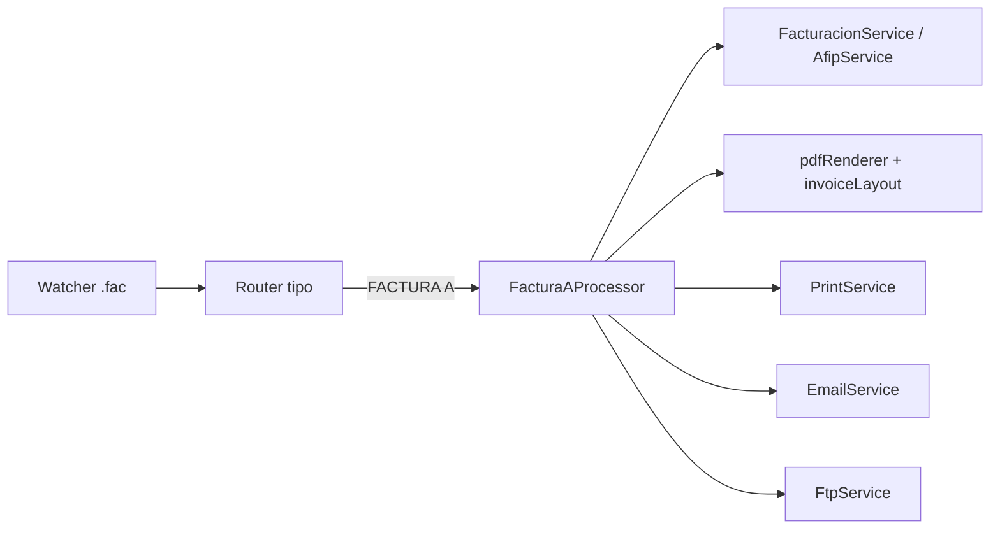

# Factura “A” por disparo de archivo .fac (FTP)

## 1️⃣ Introducción
Este documento describe la implementación técnico–funcional para procesar Factura “A” a partir de archivos .fac recibidos por FTP, reutilizando la cola secuencial y servicios comunes (PDF, impresión, email, FTP/SFTP). Objetivos: emitir ante AFIP/ARCA (CAE/QR), generar el PDF con layout, distribuir por los mismos canales que Recibo/Remito y generar .res con sufijo a.

## 2️⃣ Arquitectura general

- Watcher: reutilizado; el router detecta TIPO: FACTURA A (o nombre A.fac) y deriva al nuevo procesador.
- Procesador Factura A: parsea .fac, emite CAE/QR, genera PDF FA_<PV-4>-<NUM-8>.pdf, copia a red, imprime, envía email/WhatsApp y crea .res con sufijo a.

## 3️⃣ Watcher y enrutamiento
- Archivo: src/main.ts, función processFacQueue(). Detección de tipo y enrutamiento:
```ts
const raw = fs.readFileSync(job.fullPath, 'utf8');
let tipo = (raw.match(/\bTIPO:\s*(.+)/i)?.[1] || '').trim().toUpperCase();
if (tipo === 'FACTURA A' || /A\.fac$/i.test(job.filename)) {
  const { processFacturaAFacFile } = require('./modules/facturacion/facturaAProcessor');
  const out = await processFacturaAFacFile(job.fullPath);
}
```
- La cola sigue siendo secuencial: procesa uno por vez para evitar pérdidas.

## 4️⃣ Procesador src/modules/facturacion/facturaAProcessor.ts
Responsabilidades:
- Parseo de .fac (receptor, fecha, PV, totales/IVA consolidados, ítems para PDF, EMAIL:, WHATSAPP:, OBS.*).
- Emisión AFIP: getFacturacionService().emitirFacturaYGenerarPdf(...) → CAE y QR.
- PDF: generateInvoicePdf + invoiceLayout.mendoza, archivo FA_<PV-4>-<NUM-8>.pdf en Ventas_PV{pv}/F{YYYYMM}.
- Copias a outRed1/outRed2, impresión silenciosa (según COPIAS:), email (si EMAIL:), WhatsApp SFTP/FTP (si WHATSAPP:), y .res con sufijo a + envío por FTP.

Fragmento (simplificado):
```ts
export async function processFacturaAFacFile(fullPath: string): Promise<string> {
  const raw = fs.readFileSync(fullPath, 'utf8');
  const tipo = (raw.match(/\bTIPO:\s*(.+)/i)?.[1] || '').trim().toUpperCase();
  if (tipo !== 'FACTURA A') throw new Error('FAC no FACTURA A');
  // parseo get/getBlock(...), consolidar totales/alícuotas
  const svc = getFacturacionService();
  const r = await svc.emitirFacturaYGenerarPdf({ pto_vta: pv, tipo_cbte: 1, fecha, cuit_receptor, razon_social_receptor, condicion_iva_receptor, neto, iva, total } as any);
  // armar data PDF, generar, copiar a red, imprimir, email/whatsapp y .res (sufijo 'a')
  return localOutPath;
}
```

## 5️⃣ Integración con AFIP/ARCA
- Emisión: FacturacionService.emitirFacturaYGenerarPdf(params) → usa afipService.solicitarCAE (fork local) y retorna { numero, cae, caeVto, qrDataUrl, pdfPath }.
- Reglas:
  - Enviar totales consolidados por alícuota (no ítems línea a línea).
  - Respetar condición IVA receptor (Monotributo: comprobantes C/IVA no discriminado).
  - Validación Padrón 13 opcional si hay CUIT receptor.

## 6️⃣ Generación de PDF y layout
- pdfRenderer.generateInvoicePdf({ bgPath, outputPath, data, config, qrDataUrl }).
- invoiceLayout.mendoza.ts: posiciones para CAE/CAE Vto/QR si hiciera falta.
- Ítems del .fac: solo presentación.

Ejemplo data (esquema):
```ts
const data = {
  empresa: { pv, numero },
  cliente: { nombre, domicilio, cuitDni, condicionIva },
  fecha,
  tipoComprobanteLetra: 'A',
  tipoComprobanteLiteral: 'FACTURA',
  netoGravado: neto,
  ivaPorAlicuota: { '21': iva21, '10.5': iva105, '27': iva27 },
  ivaTotal: iva,
  total,
  cae: r.cae,
  caeVto: r.caeVto,
  items,
  fiscal: obsFiscal?.join('\n') || undefined,
  pieObservaciones: obsPie?.join('\n') || ''
};
```

## 7️⃣ Distribución y .res
- Copias a red: fs.copyFileSync(local, red1/red2).
- Impresión: PrintService.printPdf(localOutPath, printerName?, copias).
- Email: EmailService.sendReceiptEmail(to, localOutPath, { subject: 'Factura A', title: 'Factura A', intro: 'Adjuntamos la factura.' }).
- WhatsApp: generar wfa*.txt (tel +54, cliente, nombre PDF, mensaje), enviar por SFTP/FTP (canal WhatsApp) y borrar wfa*.txt local.
- .res: base del .fac (últimos 8) con sufijo a minúscula; enviar por FTP y borrar .res + .fac tras éxito.

## 8️⃣ Configuración e IPC
- config/facturaA.config.json:
```json
{ "pv": 1, "contador": 1, "outLocal": "C:\\1_AFIP", "outRed1": "\\\\correo\\backup\\FACTURAS", "outRed2": "\\\\server2008\\backup\\FACTURAS", "printerName": "HP" }
```
- IPC (main): facturaA:get-config / facturaA:save-config (merge conservador). Preload: window.api.facturaA.*.

## 9️⃣ Seguridad
- Certificados AFIP/ARCA desde almacén seguro, validar NTP, no loguear credenciales.
- Normalizar teléfonos +54… y validar emails básicos.

## 🔟 Pruebas de aceptación
- Caso feliz con EMAIL:/WHATSAPP: → PDF + impresión + envíos + .res y limpieza.
- Concurrencia → cola procesa sin pérdidas.
- Error AFIP → registrar; no generar PDF/.res; conservar .fac.

## 1️⃣1️⃣ Roadmap
- Panel UI específico (opcional) para Facturas.
- Layout A/B dedicado (posiciones CAE/QR).
- Parser .fac común con especialización por tipo.