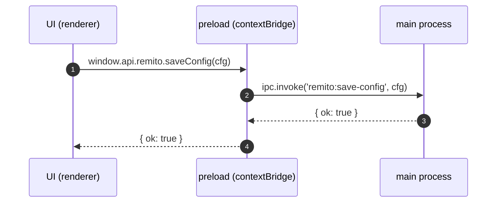

# Arquitectura de la Interfaz de Usuario (UI)

## Resumen ejecutivo
La UI es el centro operativo para configurar, diagnosticar y ejecutar los flujos de generación y distribución de comprobantes (Recibos, Remitos, y extensible a Facturas/Notas), además de servicios auxiliares (SMTP/Email, FTP/SFTP, servidor FTP interno, modo Imagen, Galicia). Está construida en HTML/CSS/JavaScript nativo sobre Electron. La UI vive en el proceso renderer y se comunica con el backend (proceso main) mediante un puente seguro (`preload`) y llamadas IPC. La creación de PDFs, impresión y transferencias se realizan en el backend; la UI orquesta entradas del usuario, valida y presenta feedback.

Los módulos principales visibles en `public/config.html` son: “Comprobantes” (submódulos Recibos y Remitos, contraídos por defecto), SMTP/Email, FTP cliente, FTP WhatsApp (SFTP preferente), Servidor FTP interno, Automatización (watcher `.fac`), Imagen y Galicia. Las vistas consumen `window.api/*` expuesto por `src/preload.ts`, siguiendo el flujo UI → preload → main → servicios.

## Índice (Tabla de contenidos)
- [1️⃣ Introducción](#1️⃣-introducción)
- [2️⃣ Arquitectura general de la UI](#2️⃣-arquitectura-general-de-la-ui)
- [3️⃣ Dependencias y librerías utilizadas en la UI](#3️⃣-dependencias-y-librerías-utilizadas-en-la-ui)
  - [Estilos y recursos gráficos](#estilos-y-recursos-gráficos)
- [4️⃣ Estructura de archivos y módulos de la UI](#4️⃣-estructura-de-archivos-y-módulos-de-la-ui)
  - [Módulo "Comprobantes" (Recibos y Remitos)](#módulo-comprobantes-contenedor-de-recibos-y-remitos)
  - [Diagrama de arquitectura de carpetas (public/)](#diagrama-de-arquitectura-de-carpetas-public)
- [5️⃣ Flujos de interacción](#5️⃣-flujos-de-interacción)
  - [Flujos de usuario (happy path y errores)](#flujos-de-usuario-happy-path-y-errores)
- [6️⃣ Comunicación con backend / main process](#6️⃣-comunicación-con-backend--main-process)
- [7️⃣ Gestión de estados y datos](#7️⃣-gestión-de-estados-y-datos)
- [8️⃣ Componentes de configuración y paneles](#8️⃣-componentes-de-configuración-y-paneles)
- [9️⃣ Dependencias con otros servicios (desde la UI)](#9️⃣-dependencias-con-otros-servicios-desde-la-ui)
- [🔟 Limitaciones actuales de la UI](#-limitaciones-actuales-de-la-ui)
  - [Accesibilidad y UX](#accesibilidad-y-ux)
  - [Consideraciones de performance](#consideraciones-de-performance)
- [1️⃣1️⃣ Recomendaciones para el diseñador](#1️⃣1️⃣-recomendaciones-para-el-diseñador)
- [1️⃣2️⃣ Apéndices](#1️⃣2️⃣-apéndices)
  - [A) Diagrama UI ↔ preload ↔ main](#a-diagrama-de-comunicación-ui--preload--main)
  - [B) Mapeo evento de UI → llamada IPC → servicio](#b-mapeo-evento-de-ui--llamada-ipc--servicio)
  - [C) Ejemplos de código (UI)](#c-ejemplos-de-código-ui)
  - [D) Inventario de IDs en public/config.html (resumen)](#d-inventario-de-ids-en-publicconfightml-resumen)

## 1️⃣ Introducción
- Propósito: La UI es el punto de orquestación y control del sistema. Permite configurar PV/NI/rutas, disparar flujos automáticos (watcher .fac), monitorear estados y ejecutar utilidades (FTP, email, impresión, imagen, Galicia, etc.).
- Rol en comprobantes: Desde la UI se configuran parámetros y destinos usados por los módulos que generan Recibos, Remitos, Facturas y otros (aunque la emisión de PDFs se activa por archivos `.fac` y lógicas en el proceso principal).
- Objetivos de usabilidad actuales:
  - Configuración clara y persistente (PV/NI/rutas, SMTP, FTP/SFTP WhatsApp, servidor FTP interno, etc.).
  - Controles para testear conectividad (FTP normal y WhatsApp SFTP/FTP), abrir carpetas/logs y ver historial.
  - Paneles colapsables para reducir ruido visual (preferencia del usuario: cerrados por defecto).

## 2️⃣ Arquitectura general de la UI
- Tecnología de base:
  - HTML/CSS/JavaScript (sin framework SPA) en `public/`.
  - Integración con Electron: la UI corre en el renderer process; usa `src/preload.ts` para exponer APIs seguras a través de `contextBridge`.
  - Comunicación con main process mediante `ipcRenderer.invoke` (desde preload) e `ipcMain.handle` (en `src/main.ts`).
- Organización:
  - `public/` contiene vistas HTML: `index.html`, `config.html`, `caja.html`, `imagen.html`, `galicia.html`, `auth.html`, `licencia.html`, `style.css`.
  - Scripts de UI están embebidos en los HTML (JS plano) y consumen `window.api`, `window.auth`, `window.license` (definidos en `src/preload.ts`).
- Flujo de comunicación:
  - UI (renderer) → `window.api.*` → preload → IPC → main → servicios/núcleo.
  - Eventos de ida y vuelta (ej.: `onFacDetected`, `onAutoTimerUpdate`) usan `ipcRenderer.on` desde preload para notificar a la UI.

## 3️⃣ Dependencias y librerías utilizadas en la UI
Tabla de dependencias principales (impacto UI directo o indirecto):

| Paquete | Versión | Rol en la UI | Dónde se usa | Configuración especial |
|---|---|---|---|---|
| electron | 30.5.1 | Contenedor desktop; IPC; impresoras | `src/preload.ts`, `src/main.ts` | `contextIsolation` habilitado; uso de `contextBridge` |
| pdf-to-printer | ^5.1.0 | Impresión silenciosa (backend, invocable desde UI) | `src/services/PrintService.ts` | Requiere spooler del SO |
| pdfkit | ^0.15.2 | Render de PDFs (backend) | `src/pdfRenderer.ts` | Fuentes opcionales vía `config/pdf.config.json` |
| dayjs | ^1.11.13 | Fechas/rutas (backend) | Varios servicios | Sin config UI |
| nodemailer | ^7.0.5 | Email (backend; UI configura SMTP) | `src/services/EmailService.ts` | SMTP configurable desde UI |
| basic-ftp | ^5.0.5 | FTP (backend; UI testea/envía manual) | `src/services/FtpService.ts` | PASV/EPSV; timeouts |
| ssh2-sftp-client | ^12.0.1 | SFTP WhatsApp (backend; UI testea/envía manual) | `src/services/FtpService.ts` | Huella SSH persistida/validada |
| electron-store | ^8.1.0 | Persistencia de config (backend) | `src/main.ts` | Almacenamiento seguro app |

Notas:
- La UI no usa frameworks como React/Vue/Angular; DOM con JS nativo.
- Estilos: `public/style.css`.

### Estilos y recursos gráficos
- CSS principal: `public/style.css`.
  - Layout de formularios (grid), esquema de color oscuro, inputs/botones, estados (éxito/advertencia/error).
  - Utilidades para espaciados, bordes, tipografía base.
- Convenciones:
  - Uso de `<details>/<summary>` para acordeones; secciones cerradas por defecto.
  - Colores: verde (éxito), azul (acción), ámbar (advertencia), rojo (error).
- Assets:
  - `public/nombre_tc.png` (logo UI en cabecera).
  - Fondos de PDFs en `templates/` (no UI directa): `MiFondoRe.jpg`, `MiFondoRm.jpg`.

## 4️⃣ Estructura de archivos y módulos de la UI
- `public/index.html`: landing/menú principal para navegar a módulos.
- `public/config.html`: panel principal de configuración.
  - Secciones colapsables:
    - Comprobantes → Recibos (PV, NI, rutas, listado de impresoras), Remitos (PV, NI, rutas, impresora opcional).
    - SMTP/Email (host/puerto/usuario/pass, tests básicos desde backend).
    - FTP cliente (host/puerto/usuario/pass/secure/dir; test y envío manual).
    - FTP WhatsApp (host/puerto/usuario/pass/dir, bandera SFTP forzada; test y envío manual).
    - Servidor FTP interno (ftp-srv) (start/stop/status, configuración de puerto/usuario/pass/root).
    - Automatización y watcher (.fac) (dir de vigilancia, habilitado, abrir carpetas/logs).
    - Imagen (control de contenido y pruebas).
    - Galicia (acciones bancarias con APIs de Galicia).
- `public/caja.html`, `public/imagen.html`, `public/galicia.html`, `public/auth.html`, `public/licencia.html`: pantallas complementarias para cajas, modo imagen, módulo Galicia y autenticación/licencias.
- `src/preload.ts`: expone todas las APIs que la UI puede usar (ver sección 6).
- `src/main.ts`: handlers IPC; orquesta servicios (FTP/Email/Print/Watcher/Facturación/etc.).

### Módulo "Comprobantes" (contenedor de Recibos y Remitos)
- Estructura UI (marcado conceptual):
```html
<details id="acc-comprobantes" open="false">
  <summary>Comprobantes</summary>
  <div>
    <details id="acc-recibos">
      <summary>Recibos</summary>
      <section id="panel-recibos">
        <input id="reciboPV" type="number" />
        <input id="reciboNI" type="number" />
        <input id="reciboOutLocal" type="text" />
        <input id="reciboOutRed1" type="text" />
        <input id="reciboOutRed2" type="text" />
        <select id="reciboPrinters"></select>
        <button id="btnSaveRecibo">Guardar Recibo</button>
      </section>
    </details>
    <details id="acc-remitos">
      <summary>Remitos</summary>
      <section id="panel-remitos">
        <input id="remitoPV" type="number" />
        <input id="remitoNI" type="number" />
        <input id="remitoOutLocal" type="text" />
        <input id="remitoOutRed1" type="text" />
        <input id="remitoOutRed2" type="text" />
        <select id="remitoPrinters"></select>
        <button id="btnSaveRemito">Guardar Remito</button>
      </section>
    </details>
  </div>
</details>
```
- Estado por defecto: los `<details>` están contraídos (cerrados) por preferencia del usuario [[memory:6127155]]. La UI abre/cierra sin recargar la página.
- Carga diferida (lazy): al expandir cada subpanel se consulta su configuración y se llenan campos.
```javascript
document.getElementById('acc-recibos')?.addEventListener('toggle', async (e) => {
  const acc = e.currentTarget as HTMLDetailsElement;
  if (!acc.open) return;
  const res = await window.api.recibo.getConfig();
  const cfg = (res && res.config) || {};
  document.getElementById('reciboPV').value = cfg.pv ?? 1;
  // ... setear NI/rutas
  const printers = await window.api.printers.list();
  // ... poblar #reciboPrinters
});
document.getElementById('acc-remitos')?.addEventListener('toggle', async (e) => {
  const acc = e.currentTarget as HTMLDetailsElement;
  if (!acc.open) return;
  const res = await window.api.remito.getConfig();
  const cfg = (res && res.config) || {};
  document.getElementById('remitoPV').value = cfg.pv ?? 1;
  // ... setear NI/rutas/printer
  const printers = await window.api.printers.list();
  // ... poblar #remitoPrinters y preseleccionar cfg.printerName si existe
});
```
- Guardado por sección:
```javascript
document.getElementById('btnSaveRecibo')?.addEventListener('click', async () => {
  const payload = { /* pv, contador, outLocal, outRed1, outRed2 */ };
  await window.api.recibo.saveConfig(payload);
});
document.getElementById('btnSaveRemito')?.addEventListener('click', async () => {
  const payload = { /* pv, contador, outLocal, outRed1, outRed2, printerName? */ };
  await window.api.remito.saveConfig(payload);
});
```

IDs y handlers relevantes (resumen):
- Recibos:
  - Inputs: `#reciboPV`, `#reciboNI`, `#reciboOutLocal`, `#reciboOutRed1`, `#reciboOutRed2`, `#reciboPrinters`.
  - Botón guardar: `#btnSaveRecibo` → `window.api.recibo.saveConfig(payload)`.
- Remitos:
  - Inputs: `#remitoPV`, `#remitoNI`, `#remitoOutLocal`, `#remitoOutRed1`, `#remitoOutRed2`, `#remitoPrinters`.
  - Botón guardar: `#btnSaveRemito` → `window.api.remito.saveConfig(payload)`.
  - Botones pruebas WhatsApp: `#btnTestWhatsappFtp`, `#btnSendWhatsappFile` → `window.api.testFtpWhatsappConnection()`, `window.api.ftpSendWhatsappFile(...)`.

## 5️⃣ Flujos de interacción
### Recibos
- Ingreso: PV (número), NI (contador inicial), rutas (`outLocal`, `outRed1`, `outRed2`).
- Validaciones: numéricas básicas; rutas no vacías para generación.
- Eventos/UI → IPC:
  - `window.api.recibo.getConfig()` al cargar panel para poblar.
  - `window.api.recibo.saveConfig({...})` al guardar cambios.
  - `window.api.printers.list()` para llenar combo de impresoras (diagnóstico).
- Feedback: mensajes “Guardado/Error”, llenado de combos, apertura de carpetas/logs.

### Remitos
- Ingreso: PV/NI, rutas, impresora específica (opcional), pruebas FTP WhatsApp.
- Validaciones: análogo a Recibo. Si se define impresora, el backend imprime por esa.
- Eventos/UI → IPC:
  - `window.api.remito.getConfig()` / `window.api.remito.saveConfig(cfg)`.
  - `window.api.printers.list()`; `window.api.printers.printPdf(path, printer?, copies?)` (diagnóstico/manual).
  - `window.api.testFtpWhatsappConnection()` y `window.api.ftpSendWhatsappFile(path, name?)`.
- Feedback: estado de test WhatsApp, logs de prueba, confirmaciones.

Diagrama de flujo (Comprobantes):
```mermaid
flowchart TD
  A[Expandir Comprobantes] --> B{Expandir Recibos?}
  B -- Sí --> C[UI llama recibo.getConfig]
  C --> D[UI llena inputs]\nUI lista impresoras
  D --> E[Guardar Recibo]\nrecibo.saveConfig
  B -- No --> F{Expandir Remitos?}
  F -- Sí --> G[UI llama remito.getConfig]
  G --> H[UI llena inputs y printers]
  H --> I[Guardar Remito]\nremito.saveConfig
  H --> J[Test WhatsApp]\n test-ftp-whatsapp
  H --> K[Enviar archivo WhatsApp]\n ftp:send-file-whatsapp
```

### Diagrama de arquitectura de carpetas (public/)
```text
public/
  index.html           (landing / navegación)
  config.html          (panel de configuración principal)
  caja.html            (modo caja)
  imagen.html          (modo imagen)
  galicia.html         (módulo Galicia)
  auth.html            (inicio de sesión / configuración auth)
  licencia.html        (gestión de licencias)
  style.css            (estilos globales UI)
  nombre_tc.png        (logo UI)
```
Relaciones: HTML incluye scripts inline que consumen `window.api/*`; `style.css` define estilos compartidos.

Notas sobre colapsado y carga diferida:
- El contenedor "Comprobantes" y cada subpanel (Recibos/Remitos) cargan su data al expandirse, evitando trabajo innecesario y manteniendo la UI responsiva.
- Este comportamiento preserva el requerimiento de secciones cerradas por defecto y reduce errores al guardar, ya que cada botón persiste solo su ámbito.

### Otros módulos (Imagen, Galicia, FTP Server, Auto)
### Flujos de usuario (happy path y errores)
#### Recibos — Happy path
1. Expandir “Comprobantes” → “Recibos”; la UI carga `recibo.getConfig` y lista impresoras.
2. Completar PV, NI y rutas; “Guardar Recibo”.
3. La UI muestra confirmación; el backend usará esta config al llegar `.fac`.

Errores típicos y feedback:
- PV/NI no numéricos: resaltar control y mostrar mensaje junto al campo.
- Rutas vacías: advertencia (“Ruta local requerida”).
- Error de guardado IPC: mensaje rojo con `{ error }` devuelto.

#### Remitos — Happy path
1. Expandir “Remitos”; cargar `remito.getConfig` y lista de impresoras (preseleccionar guardada).
2. Ajustar PV/NI/rutas/impresora; “Guardar Remito”.
3. La UI confirma; al llegar `.fac` REMITO, backend genera PDF, copia a red, imprime y (si aplica) envía por WhatsApp.

Errores y feedback:
- Impresora no disponible: advertencia; backend puede usar predeterminada.
- WhatsApp test: timeout/credenciales: mensaje con código y sugerencias (verificar puerto/huella SSH/dir).

#### SMTP/FTP — Happy path
1. SMTP: ingresar host/puerto/usuario/clave; guardar; test opcional.
2. FTP: ingresar host/puerto/user/pass/dir; “Probar FTP”; “Enviar archivo” manual; ver estados.

Errores y feedback:
- SMTP: login/puerto inválidos → mensaje claro.
- FTP: `ETIMEDOUT`/login failed → mensaje con detalle y recomendaciones.

- Imagen: botones para test de contenido y suscripción a eventos `image:new-content`.
- Galicia: botones para consultar saldos/movimientos y crear cobranzas (IPC dedicados).
- FTP Server: start/stop/status (UI invoca IPC y muestra resultado).
- Auto/Watcher: set/get dir, enable, open dir, abrir log actual y lista de historial.

## 6️⃣ Comunicación con backend / main process
Funciones expuestas en `src/preload.ts` (principales usadas por UI):
- Config genérica: `getConfig()`, `saveConfig(cfg)`.
- Reportes: `generateReport()`, `exportReport()`, `sendReportEmail()`.
- FTP cliente: `testFtpConnection()`, `ftpSendFile(localPath, remoteName?)`, `sendDbfViaFtp()`, `clearFtpHash()`.
- FTP WhatsApp: `testFtpWhatsappConnection()`, `ftpSendWhatsappFile(localPath, remoteName?)`.
- Errores: `error-notifications:*` (get/update/summary/clear/reset).
- Auto: `autoStart/Stop/Status/Pause/Resume/GetTimer`, eventos `onAutoReportNotice`, `onAutoTimerUpdate`.
- Vistas: `openView(view)`, `setWindowSize(w,h)`, `getAppVersion()`, `getReleaseNotes()`.
- FTP Server: `ftp-server:start/stop/status`.
- Imagen: `image:test-control`, evento `image:new-content`.
- Utils: `openPath(fullPath)`.
- Facturación: `facturacion.{guardarConfig, emitir, listar, abrirPdf, empresaGet/Save, paramGet/Save, listarPdfs, idempotencyList/Cleanup, validateCAE*, getCAEStatus*, findExpiring/ExpiredCAE, emitirConProvincias, padron13*, fceConsultarObligado, listarPuntosDeVenta, get/set watcher dir, onFacDetected}`.
- Recibo: `recibo.getConfig()`, `recibo.saveConfig(cfg)`.
- Remito: `remito.getConfig()`, `remito.saveConfig(cfg)`.
- Impresoras: `printers.list()`, `printers.printPdf(filePath, printerName?, copies?)`.
- AFIP y seguridad/licencia: múltiples IPC en `auth:*`, `license:*`.

Ejemplo (UI → guardado de Remito):
```javascript
const cfg = {
  pv: Number(pvInput.value),
  contador: Number(niInput.value),
  outLocal: outLocalInput.value,
  outRed1: outRed1Input.value,
  outRed2: outRed2Input.value,
  printerName: printerSelect.value || undefined,
};
await window.api.remito.saveConfig(cfg);
```

Tipos de parámetros y respuestas (TypeScript):
```ts
recibo: {
  getConfig: () => Promise<{ ok: boolean; config?: { pv: number; contador: number; outLocal?: string; outRed1?: string; outRed2?: string }; error?: string }>,
  saveConfig: (cfg: { pv?: number; contador?: number; outLocal?: string; outRed1?: string; outRed2?: string }) => Promise<{ ok: boolean; error?: string }>,
},
remito: {
  getConfig: () => Promise<{ ok: boolean; config?: { pv: number; contador: number; outLocal?: string; outRed1?: string; outRed2?: string; printerName?: string }; error?: string }>,
  saveConfig: (cfg: { pv?: number; contador?: number; outLocal?: string; outRed1?: string; outRed2?: string; printerName?: string }) => Promise<{ ok: boolean; error?: string }>,
},
printers: {
  list: () => Promise<{ ok: boolean; printers?: Array<any>; error?: string }>,
  printPdf: (filePath: string, printerName?: string, copies?: number) => Promise<{ ok: boolean; error?: string }>,
}
```

Manejo de errores:
- Handlers IPC retornan `{ ok:false, error }` en fallos; la UI muestra el mensaje y mantiene el estado del formulario.
- Para pruebas de red (FTP/SFTP), se recomienda mostrar códigos crudos y un texto guía corto.

## 7️⃣ Gestión de estados y datos
- Persistencia:
  - Configuraciones de Recibo/Remito en JSON bajo `config/` (ej.: `recibo.config.json`, `remito.config.json`).
  - Global app config (SMTP/FTP/WhatsApp/etc.) gestionada en main con `electron-store`.
- Carga/guardado:
  - La UI invoca `getConfig`/`saveConfig` (por tipo) y muestra/actualiza inputs.
- Cache/almacenamiento local: no se usa `localStorage` para configuraciones críticas; se confía en persistencia de archivos/`electron-store`.

## 8️⃣ Componentes de configuración y paneles
- Recibos (public/config.html):
  - Inputs: `pv`, `contador`, `outLocal`, `outRed1`, `outRed2`.
  - Acciones: guardar, listar impresoras.
- Remitos (public/config.html):
  - Inputs: `pv`, `contador`, `outLocal`, `outRed1`, `outRed2`, `printerName`.
  - Acciones: guardar, listar impresoras; test WhatsApp (SFTP preferente); enviar archivo manual a WhatsApp.
- SMTP/Email: host, puerto, usuario, password; probar desde backend.
- FTP cliente: host, port, user, pass, secure, dir; testear; enviar manual.
- FTP WhatsApp: IP/port/user/pass/dir; SFTP forzado; testear; enviar manual.
- Servidor FTP interno: puerto, user, pass, root; start/stop/status.
- Automatización: watcher `.fac` (dir, habilitar, abrir dir, abrir log, histórico).
- Imagen y Galicia: controles específicos de sus módulos.

## 9️⃣ Dependencias con otros servicios (desde la UI)
- Impresión: UI lista impresoras y puede disparar `printers.printPdf` (pruebas). La impresión productiva ocurre tras generar PDF (backend/PrintService).
- Email: UI configura SMTP; envío se dispara automáticamente desde backend cuando el `.fac` trae `EMAIL:`.
- FTP/SFTP: UI configura y prueba credenciales; el backend realiza envíos (normales y WhatsApp SFTP/FTP) según flujos de Recibo/Remito.

## 🔟 Limitaciones actuales de la UI
- Sin framework de UI: mantenimiento de scripts inline puede crecer en complejidad.
- Validaciones básicas: se apoyan en backend para errores de negocio.
- Estados/feedback: algunos procesos son asíncronos; logs en consola pueden ser necesarios para diagnóstico.
- Impresoras: el listado depende de Electron/OS; puede variar por entorno.
  - Recomendación UX: mostrar nombre, estado y si es predeterminada; indicar impresora activa (si aplica) para Remitos.

### Accesibilidad y UX
- Teclado y foco: foco visible, orden de tabulación coherente por panel; `Enter`/`Space` activan botones.
- Contraste: cumplir WCAG 2.1 AA (mín. 4.5:1); evitar texto claro sobre fondo claro.
- Responsivo: composición en 1–2 columnas según ancho; evitar scroll horizontal.
- Mensajes: colores consistentes (verde/ámbar/rojo) e iconografía simple.

### Consideraciones de performance
- Lazy-load: datos de paneles sólo al expandir `<details>`.
- Impresoras: `printers.list()` bajo demanda; evitar llamadas repetidas.
- Listeners: no registrar múltiples veces al reabrir; usar banderas/cleanup.
- Debounce: aplicar a entradas con validaciones en vivo.
- Trabajo pesado en backend: impresión/PDF/FTP/Email no deben bloquear el renderer.

## 1️⃣1️⃣ Recomendaciones para el diseñador
- Mantener:
  - Guardado por secciones con merge conservador (no perder claves no presentes en payload).
  - Secciones colapsables por defecto para no saturar.
  - Botones de prueba (FTP, WhatsApp, servidor FTP, impresoras) para diagnósticos.
- Rediseñar libremente:
  - Layout y estilos de `public/config.html` (grids, tipografías, jerarquía visual), manteniendo los mismos IDs de inputs/botones o ajustando el script en conjunto.
  - Feedback visual (toasts, badges de estado, progress inline) para operaciones asíncronas.
  - Agrupar paneles bajo “Comprobantes” con submódulos (Recibos/Remitos) y futura extensibilidad a Facturas/Notas.
- Organización sugerida:
  - Separar scripts por módulo (Recibos/Remitos/FTP/WhatsApp) y usar módulos ES para mayor mantenibilidad.
  - Introducir una capa fina de helpers (DOM/query, validaciones, sección de toasts).
  - Añadir pruebas de accesibilidad (focus visible, labels asociados, contraste AA, navegación teclado).

Roadmap para rediseño (prioridades):
1. Unificar cabecera, tipografías y paleta; crear componentes reutilizables (botones, inputs, alerts).
2. Reorganizar `config.html` en tabs/acordeones con lazy-load por módulo; mantener IDs o alinear scripts.
3. Feedback de acciones asíncronas: toasts/badges/loaders visibles, especialmente en pruebas FTP/SFTP/WhatsApp.
4. Accesibilidad AA: foco visible, contraste, labels; atajos simples para acciones frecuentes.
5. Gestión de impresoras: mostrar predeterminada/activa, botón “refrescar lista” y estado.
6. Documentar guía de estilos ligera en `docs/` con ejemplos.

## 1️⃣2️⃣ Apéndices
### A) Diagrama de comunicación UI ↔ preload ↔ main


### B) Mapeo evento de UI → llamada IPC → servicio
- Guardar Recibo → `recibo:save-config` → persistencia JSON en main.
- Guardar Remito → `remito:save-config` → persistencia JSON en main.
- Listar impresoras → `printers:list` → `webContents.getPrinters*` en main.
- Probar FTP WhatsApp → `test-ftp-whatsapp` → `FtpService.testWhatsappFtp`.
- Enviar archivo a WhatsApp → `ftp:send-file-whatsapp` → `FtpService.sendWhatsappFile`.
- Abrir PDF/dir/log → `open-path`/handlers dedicados en main.

### C) Ejemplos de código (UI)
```html
<!-- public/config.html (fragmento conceptual) -->
<select id="remitoPrinter"></select>
<button id="btnSaveRemito">Guardar Remito</button>
<script>
  async function loadRemito() {
    const res = await window.api.remito.getConfig();
    const cfg = res?.config || {};
    document.getElementById('remitoPV').value = cfg.pv || 1;
    // ...
  }
  document.getElementById('btnSaveRemito').addEventListener('click', async () => {
    const payload = {/* leer inputs */};
    await window.api.remito.saveConfig(payload);
  });
</script>
```

### D) Inventario de IDs en `public/config.html` (resumen)

Comprobantes:
- Recibos: `#sec-comprobantes`, `#sec-recibos`, `#REC_PV`, `#REC_NI`, `#REC_NEXT`, `#REC_OUT_LOCAL`, `#REC_OUT_RED1`, `#REC_OUT_RED2`, `#REC_PRINTER`, `#btnReciboTestPrint`, `#btnReciboGuardar`, `#reciboStatus`.
- Remitos: `#sec-remitos`, `#REM_PV`, `#REM_NI`, `#REM_NEXT`, `#REM_OUT_LOCAL`, `#REM_OUT_RED1`, `#REM_OUT_RED2`, `#REM_PRINTER`, `#btnRemitoGuardar`, `#remitoStatus`.

FTP cliente:
- `#FTP_IP`, `#FTP_PORT`, `#FTP_SECURE`, `#FTP_USER`, `#FTP_PASS`, `#btnToggleFtpPass`, `#FTP_DIR`, `#FTP_FILE`, `#btnTestFtp`, `#ftpTestStatus`, `#FTP_SEND_FILE_PATH`, `#btnPickLocalFile`, `#btnSendLocalFile`.

FTP WhatsApp:
- `#FTP_WHATSAPP_IP`, `#FTP_WHATSAPP_PORT`, `#FTP_WHATSAPP_SECURE`, `#FTP_WHATSAPP_SFTP`, `#FTP_WHATSAPP_USER`, `#FTP_WHATSAPP_PASS`, `#btnToggleFtpWPass`, `#FTP_WHATSAPP_DIR`, `#btnTestFtpWhatsapp`, `#ftpWhatsappTestStatus`, `#btnSaveWhatsappCfg`, `#waSaveStatus`, `#FTP_WA_SEND_FILE_PATH`, `#btnPickLocalFileWa`, `#btnSendLocalFileWa`.

SMTP/Email:
- `#EMAIL_REPORT`, `#EMAIL_REPORT_HELP`, `#SMTP_HOST`, `#SMTP_PORT`, `#SMTP_USER`, `#SMTP_PASS`, `#btnToggleSmtpPass`.

Servidor FTP interno:
- `#FTP_SRV_HOST`, `#FTP_SRV_PORT`, `#FTP_SRV_USER`, `#FTP_SRV_PASS`, `#FTP_SRV_ROOT`, `#FTP_SRV_ENABLED`, `#FTP_SRV_PASV_MIN`, `#FTP_SRV_PASV_MAX`.

Perfiles:
- `#perfiles-config-primary`, `#perfilSelect`, `#perfilSelectedTag`, `#btnPerfilAplicar`, `#btnPerfilGuardarNuevo`, `#btnPerfilEditar`, `#btnPerfilExportar`, `#btnPerfilImportar`, `#perfilImportFile`, `#perfilPreview`.

Cabecera y navegación:
- `#brandLogo`, `#activePerfilTag`, `#btnOpenLogs`, `#btnOpenCaja`, `#btnOpenImagen`, `#tab-config`, `#perfilPermWarning`, `#configForm`.

Facturación/MP y otros (extracto):
- `#sec-mercado-pago`, `#MP_ACCESS_TOKEN`, `#btnToggleToken`, `#MP_USER_ID`, `#btnTest`, `#testStatus`, `#MP_TZ`, `#MP_WINDOW_START`, `#MP_WINDOW_END`, `#MP_DATE_FROM`, `#MP_DATE_TO`, `#MP_NO_DATE_FILTER`, `#MP_DAYS_BACK`, `#MP_RANGE`, `#MP_STATUS`, `#MP_LIMIT`, `#MP_MAX_PAGES`.

Eventos asociados típicos:
- Click: `#btnReciboGuardar`, `#btnRemitoGuardar`, `#btnTestFtp`, `#btnSendLocalFile`, `#btnTestFtpWhatsapp`, `#btnSaveWhatsappCfg`, `#btnSendLocalFileWa`, `#btnPerfilAplicar`, etc.
- Toggle `<details>`: `#sec-comprobantes`, `#sec-recibos`, `#sec-remitos` → disparan carga de configuración y listado de impresoras.
- Change/Input: campos de texto/number/checkbox para componer payloads de guardado.
