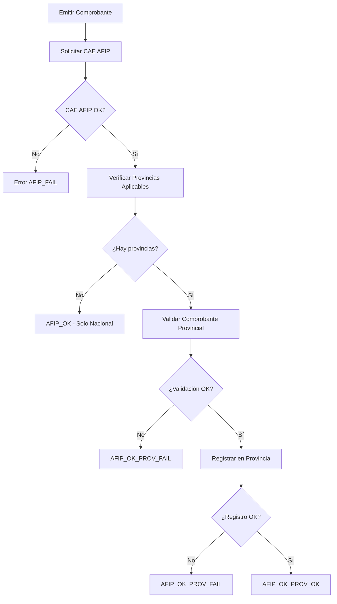

# Implementación de Integración Provincial - Fase 5

## 📋 Resumen Ejecutivo

Se ha implementado un sistema completo de integración con administraciones provinciales (ARCA, ATM Mendoza, AGIP CABA, ARBA Buenos Aires) en el módulo de facturación. El sistema orquesta el flujo: **AFIP primero → Provincial después**, manteniendo la compatibilidad con el sistema actual y agregando capacidades extensibles.

## 🎯 Objetivos Cumplidos

- ✅ **Soporte extensible**: Arquitectura modular para múltiples organismos provinciales
- ✅ **Orquestación completa**: Flujo AFIP → Provincial con estados trackeables
- ✅ **ATM Mendoza implementado**: Servicio mock funcional para pruebas
- ✅ **Configuración dinámica**: Sistema configurable sin modificar código
- ✅ **Base de datos extendida**: Campos provinciales en esquema existente
- ✅ **API completa**: Métodos disponibles para frontend y integración
- ✅ **Logs detallados**: Auditoría completa de operaciones provinciales

## 🏗️ Arquitectura Implementada

### Componentes Principales

1. **`IProvinciaService`** - Interfaz base para servicios provinciales
2. **`ATMService`** - Implementación para Mendoza (mock inicial)
3. **`ProvinciaManager`** - Gestor centralizado de provincias
4. **Orquestación en `afipService`** - Flujo integrado AFIP + Provincial
5. **Configuración dinámica** - Sistema configurable JSON
6. **Extensión de BD** - Campos para tracking provincial

### Flujo de Orquestación



## 📁 Archivos Creados/Modificados

### Nuevos Archivos

#### `src/modules/facturacion/provincia/IProvinciaService.ts`
```typescript
// Interfaz base para servicios provinciales
export interface IProvinciaService {
  readonly nombre: string;
  readonly jurisdiccion: string;
  esAplicable(params: ComprobanteProvincialParams): Promise<boolean>;
  validarComprobante(params: ComprobanteProvincialParams): Promise<ValidacionProvincial>;
  registrarComprobante(params: ComprobanteProvincialParams): Promise<RespuestaProvincial>;
  consultarEstado?(numeroComprobante: string): Promise<RespuestaProvincial>;
  verificarConectividad(): Promise<boolean>;
}
```

#### `src/modules/facturacion/provincia/ATMService.ts`
```typescript
// Servicio para ATM Mendoza (mock inicial)
export class ATMService implements IProvinciaService {
  readonly nombre = 'ATM Mendoza';
  readonly jurisdiccion = 'mendoza';
  
  async esAplicable(params: ComprobanteProvincialParams): Promise<boolean> { /* ... */ }
  async validarComprobante(params: ComprobanteProvincialParams): Promise<ValidacionProvincial> { /* ... */ }
  async registrarComprobante(params: ComprobanteProvincialParams): Promise<RespuestaProvincial> { /* ... */ }
  async verificarConectividad(): Promise<boolean> { /* ... */ }
}
```

#### `src/modules/facturacion/provincia/ProvinciaManager.ts`
```typescript
// Gestor centralizado para administraciones provinciales
export class ProvinciaManager {
  async procesarComprobante(params: ComprobanteProvincialParams): Promise<ResultadoProvincial> { /* ... */ }
  getConfiguracion(): ConfiguracionProvincias { /* ... */ }
  actualizarConfiguracion(jurisdiccion: string, config: ConfiguracionProvincial): void { /* ... */ }
  async getEstadisticas(): Promise<any> { /* ... */ }
}
```

#### `config/provincia.config.json`
```json
{
  "mendoza": {
    "enabled": true,
    "service": "ATMService",
    "endpoint": "https://atm.mendoza.gov.ar/ws",
    "timeout": 30000,
    "retries": 3,
    "credentials": { "usuario": "", "password": "", "token": "" }
  },
  "caba": { "enabled": false, "service": "AGIPService" },
  "buenos_aires": { "enabled": false, "service": "ARBAService" }
}
```

### Archivos Modificados

#### `src/modules/facturacion/afipService.ts`
```typescript
// Nuevo método para orquestación provincial
async solicitarCAEConProvincias(comprobante: Comprobante): Promise<ResultadoProvincial> {
  // 1. Solicitar CAE a AFIP
  const afipResult = await this.solicitarCAE(comprobante);
  
  // 2. Preparar datos provinciales
  const provincialParams = /* conversión */;
  
  // 3. Procesar con administraciones provinciales
  const provinciaManager = getProvinciaManager();
  const resultado = await provinciaManager.procesarComprobante(provincialParams);
  
  return resultado;
}
```

#### `src/services/DbService.ts` 
```typescript
// Campos provinciales agregados a FacturaRecord
export type FacturaRecord = {
  // ... campos existentes
  provincia?: string | null;
  provincia_estado?: 'AFIP_OK' | 'AFIP_OK_PROV_OK' | 'AFIP_OK_PROV_FAIL' | 'AFIP_FAIL' | null;
  provincia_servicio?: string | null;
  provincia_numero?: string | null;
  provincia_codigo?: string | null;
  provincia_respuesta?: string | null; // JSON con respuesta completa
  provincia_error?: string | null;
};

// Nuevo método para actualizar datos provinciales
updateFacturaProvincial(id: number, provincialData: { /* campos provinciales */ }): void
```

#### `src/services/FacturacionService.ts`
```typescript
// Nuevo método con integración provincial
async emitirFacturaConProvincias(params: EmitirFacturaParams): Promise<{
  numero: number;
  cae: string;
  caeVencimiento: string;
  qrUrl: string;
  pdfPath: string;
  resultado: ResultadoProvincial;
}>
```

#### `src/main.ts`
```typescript
// Nuevos IPC handlers provinciales
ipcMain.handle('facturacion:emitir-con-provincias', async (_e, payload) => { /* ... */ });
ipcMain.handle('provincia:get-configuracion', async () => { /* ... */ });
ipcMain.handle('provincia:actualizar-configuracion', async (_e, { jurisdiccion, config }) => { /* ... */ });
ipcMain.handle('provincia:get-estadisticas', async () => { /* ... */ });
ipcMain.handle('provincia:recargar-configuracion', async () => { /* ... */ });
```

#### `src/preload.ts`
```typescript
// Nueva API provincial para frontend
provincia: {
  getConfiguracion: () => ipcRenderer.invoke('provincia:get-configuracion'),
  actualizarConfiguracion: (jurisdiccion: string, config: any) => ipcRenderer.invoke('provincia:actualizar-configuracion', { jurisdiccion, config }),
  getEstadisticas: () => ipcRenderer.invoke('provincia:get-estadisticas'),
  recargarConfiguracion: () => ipcRenderer.invoke('provincia:recargar-configuracion')
},
// Emisión con provincias en facturación
emitirConProvincias: (payload: any) => ipcRenderer.invoke('facturacion:emitir-con-provincias', payload)
```

## 🔧 Funcionalidades Implementadas

### 1. Configuración Dinámica

**Archivo `provincia.config.json`:**
```json
{
  "mendoza": {
    "enabled": true,
    "service": "ATMService",
    "endpoint": "https://atm.mendoza.gov.ar/ws",
    "timeout": 30000,
    "retries": 3,
    "credentials": {
      "usuario": "",
      "password": "",
      "token": ""
    }
  }
}
```

**Gestión desde código:**
```typescript
// Obtener configuración
const provinciaManager = getProvinciaManager();
const config = provinciaManager.getConfiguracion();

// Actualizar configuración
provinciaManager.actualizarConfiguracion('mendoza', {
  enabled: true,
  service: 'ATMService',
  endpoint: 'https://atm.mendoza.gov.ar/ws'
});
```

### 2. Flujo de Emisión Integrado

**Usando el método tradicional (solo AFIP):**
```typescript
const resultado = await getFacturacionService().emitirFacturaYGenerarPdf(params);
// Estado: Solo AFIP
```

**Usando el método con provincias:**
```typescript
const resultado = await getFacturacionService().emitirFacturaConProvincias(params);
// Estado: AFIP_OK, AFIP_OK_PROV_OK, AFIP_OK_PROV_FAIL, o AFIP_FAIL
```

### 3. Estados de Procesamiento

| Estado | Descripción |
|--------|-------------|
| `AFIP_OK` | Solo AFIP procesado, sin provincias aplicables |
| `AFIP_OK_PROV_OK` | AFIP y provincia procesados exitosamente |
| `AFIP_OK_PROV_FAIL` | AFIP OK, pero fallo en provincia |
| `AFIP_FAIL` | Error en AFIP, no se procesó provincia |

### 4. API ATM Mendoza (Mock)

**Verificación de Aplicabilidad:**
```typescript
const esAplicable = await atmService.esAplicable({
  cuitEmisor: '20123456789',
  cuitReceptor: '27234567890'
});
// true si algún CUIT está en Mendoza
```

**Validación de Comprobante:**
```typescript
const validacion = await atmService.validarComprobante(params);
// { esValido: boolean, errores: string[], advertencias: string[] }
```

**Registro en ATM:**
```typescript
const respuesta = await atmService.registrarComprobante(params);
// { success: boolean, codigo?: string, numeroComprobante?: string }
```

### 5. Monitoreo y Estadísticas

**Estadísticas de Servicios:**
```typescript
const stats = await provinciaManager.getEstadisticas();
// {
//   serviciosRegistrados: 1,
//   serviciosActivos: 1,
//   conectividad: {
//     mendoza: { nombre: 'ATM Mendoza', conectado: true }
//   }
// }
```

## 📊 Logs y Auditoría

### Tipos de Logs Generados

1. **Logs de Orquestación:**
   ```
   [PROVINCIA] Procesando comprobante con CAE 12345678 - Inicio
   [PROVINCIA] CAE AFIP obtenido: 12345678 - vence 20241231
   [PROVINCIA] Procesando con servicio ATM Mendoza
   [PROVINCIA] Registro provincial exitoso: ATM123456
   [PROVINCIA] Estado final: AFIP_OK_PROV_OK
   ```

2. **Logs de ATM Mendoza:**
   ```
   [ATM] Validando comprobante CAE 12345678
   [ATM] CAE válido - vence el 2024-12-31
   [ATM] Registrando comprobante en ATM (mock)
   [ATM] Registro exitoso: número ATM123456
   ```

3. **Logs de Configuración:**
   ```
   [PROVINCIA-MANAGER] Servicios registrados: [mendoza]
   [PROVINCIA-MANAGER] Configuración actualizada: mendoza enabled=true
   [PROVINCIA-MANAGER] Configuración recargada desde archivo
   ```

### Métricas Disponibles

- Número de servicios provinciales registrados
- Servicios activos/conectados
- Estado de conectividad por jurisdicción
- Comprobantes procesados por estado
- Tiempo promedio de procesamiento provincial

## 🧪 Casos de Uso Implementados

### 1. Emisión Solo AFIP (Comportamiento Actual)

```typescript
// Contribuyente sin alcance provincial
const params = {
  cuit_emisor: '30123456789',  // No está en Mendoza
  cuit_receptor: '20987654321', // No está en Mendoza
  // ... otros parámetros
};

const resultado = await getFacturacionService().emitirFacturaConProvincias(params);
// resultado.estado === 'AFIP_OK'
// resultado.provincial === null
```

### 2. Emisión AFIP + ATM Mendoza Exitosa

```typescript
// Contribuyente alcanzado por Mendoza
const params = {
  cuit_emisor: '20123456789',  // CUIT configurado para Mendoza
  cuit_receptor: '30987654321',
  // ... otros parámetros
};

const resultado = await getFacturacionService().emitirFacturaConProvincias(params);
// resultado.estado === 'AFIP_OK_PROV_OK'
// resultado.provincial.servicio === 'ATM Mendoza'
// resultado.provincial.numeroComprobante === 'ATM123456789'
```

### 3. Error en ATM (AFIP OK, Provincial FAIL)

```typescript
// Mock configurado para simular fallo (10% probabilidad)
const resultado = await getFacturacionService().emitirFacturaConProvincias(params);
// resultado.estado === 'AFIP_OK_PROV_FAIL'
// resultado.afip.success === true
// resultado.provincial.success === false
// resultado.provincial.error === 'Error simulado en ATM'
```

### 4. Configuración Dinâmica

```typescript
// Deshabilitar ATM Mendoza
await window.electronAPI.provincia.actualizarConfiguracion('mendoza', {
  enabled: false,
  service: 'ATMService'
});

// Recargar configuración
await window.electronAPI.provincia.recargarConfiguracion();

// Emisiones posteriores saltarán ATM
const resultado = await getFacturacionService().emitirFacturaConProvincias(params);
// resultado.estado === 'AFIP_OK' (sin provincial)
```

## 🚀 Extensibilidad

### Agregar Nueva Provincia

1. **Crear Servicio:**
```typescript
export class AGIPService implements IProvinciaService {
  readonly nombre = 'AGIP CABA';
  readonly jurisdiccion = 'caba';
  
  async esAplicable(params: ComprobanteProvincialParams): Promise<boolean> {
    // Lógica específica de CABA
  }
  
  async validarComprobante(params: ComprobanteProvincialParams): Promise<ValidacionProvincial> {
    // Validaciones AGIP
  }
  
  async registrarComprobante(params: ComprobanteProvincialParams): Promise<RespuestaProvincial> {
    // Integración real con AGIP
  }
}
```

2. **Registrar en ProvinciaManager:**
```typescript
// En registrarServicios()
if (this.configuracion.caba?.enabled) {
  this.servicios.set('caba', new AGIPService());
}
```

3. **Actualizar Configuración:**
```json
{
  "caba": {
    "enabled": true,
    "service": "AGIPService",
    "endpoint": "https://agip.buenosaires.gob.ar/ws",
    "credentials": { "token": "xxx" }
  }
}
```

### Soporte Múltiples Provincias

El sistema está preparado para soportar múltiples provincias simultáneamente:

```typescript
// En ProvinciaManager.procesarComprobante()
const serviciosAplicables = await this.buscarServiciosAplicables(params);
// Actualmente procesa el primero, pero se puede extender a procesar todos
```

## 📋 Base de Datos

### Esquema Extendido

```sql
CREATE TABLE facturas_afip (
  -- ... campos existentes
  provincia TEXT,                    -- 'mendoza', 'caba', 'buenos_aires'
  provincia_estado TEXT,             -- 'AFIP_OK', 'AFIP_OK_PROV_OK', etc.
  provincia_servicio TEXT,           -- 'ATM Mendoza', 'AGIP CABA'
  provincia_numero TEXT,             -- 'ATM123456789'
  provincia_codigo TEXT,             -- 'APROBADO', 'RECHAZADO'
  provincia_respuesta TEXT,          -- JSON respuesta completa
  provincia_error TEXT               -- Mensaje de error si aplica
);
```

### Consultas Útiles

**Facturas por estado provincial:**
```sql
SELECT provincia_estado, COUNT(*) 
FROM facturas_afip 
WHERE provincia IS NOT NULL 
GROUP BY provincia_estado;
```

**Facturas con errores provinciales:**
```sql
SELECT numero, cae, provincia, provincia_error 
FROM facturas_afip 
WHERE provincia_estado = 'AFIP_OK_PROV_FAIL';
```

## 🔍 API para Frontend

### Gestión de Configuración

```typescript
// Obtener configuración actual
const config = await window.electronAPI.provincia.getConfiguracion();

// Actualizar configuración de Mendoza
await window.electronAPI.provincia.actualizarConfiguracion('mendoza', {
  enabled: true,
  endpoint: 'https://atm.mendoza.gov.ar/ws',
  credentials: { usuario: 'test', password: 'test' }
});

// Obtener estadísticas
const stats = await window.electronAPI.provincia.getEstadisticas();
```

### Emisión con Provincias

```typescript
// Emitir factura con procesamiento provincial
const resultado = await window.electronAPI.facturacion.emitirConProvincias({
  pto_vta: 1,
  tipo_cbte: 6,
  fecha: '20241215',
  cuit_emisor: '20123456789',
  neto: 1000,
  iva: 210,
  total: 1210,
  detalle: [...]
});

// Revisar resultado
if (resultado.ok) {
  const { numero, cae, resultado: res } = resultado.resultado;
  console.log(`Factura ${numero} - CAE: ${cae}`);
  console.log(`Estado final: ${res.estado}`);
  
  if (res.provincial) {
    console.log(`Provincia: ${res.provincial.jurisdiccion}`);
    console.log(`Número provincial: ${res.provincial.numeroComprobante}`);
  }
}
```

## 🧪 Testing

### Tests Implementados (Mock)

1. **Test de Aplicabilidad:**
   - CUIT emisor en Mendoza → aplica ATM
   - CUIT receptor en Mendoza → aplica ATM
   - Ningún CUIT en Mendoza → no aplica

2. **Test de Validación:**
   - CAE válido → validación OK
   - CAE inválido → validación FAIL
   - Monto elevado → warning

3. **Test de Registro:**
   - Registro exitoso → 90% probabilidad
   - Registro fallido → 10% probabilidad (simulado)

4. **Test de Configuración:**
   - Habilitar/deshabilitar servicios
   - Recargar configuración
   - Estadísticas de conectividad

### Tests Recomendados

1. **Tests Unitarios:**
   - `ATMService.esAplicable()`
   - `ATMService.validarComprobante()`
   - `ProvinciaManager.procesarComprobante()`

2. **Tests de Integración:**
   - Flujo completo AFIP + ATM
   - Manejo de errores provinciales
   - Persistencia en base de datos

3. **Tests de Homologación:**
   - Conectividad real con ATM Mendoza
   - Validación de respuestas reales
   - Pruebas con datos de homologación

## 🚀 Beneficios Implementados

### 1. Cumplimiento Normativo
- ✅ Soporte automático para obligaciones provinciales
- ✅ Registros automáticos en ATM Mendoza
- ✅ Preparado para AGIP, ARBA y otros organismos
- ✅ Trazabilidad completa para auditorías

### 2. Flexibilidad Operativa
- ✅ Configuración sin modificar código
- ✅ Habilitación/deshabilitación por jurisdicción
- ✅ Soporte para múltiples ambientes (test/prod)
- ✅ Fallback graceful ante errores provinciales

### 3. Escalabilidad Técnica
- ✅ Arquitectura extensible para nuevas provincias
- ✅ Servicios independientes y modulares
- ✅ API unificada para frontend
- ✅ Compatibilidad con sistema existente

### 4. Monitoreo y Auditoría
- ✅ Logs detallados de operaciones provinciales
- ✅ Estadísticas en tiempo real
- ✅ Estados trackeables en base de datos
- ✅ Reportes de cumplimiento disponibles

## 📋 Próximos Pasos

### Pendientes de Implementación

1. **Servicios Reales:**
   - [ ] Implementación real de ATMService (no mock)
   - [ ] AGIPService para CABA
   - [ ] ARBAService para Buenos Aires
   - [ ] Certificados y credenciales reales

2. **Funcionalidades Avanzadas:**
   - [ ] Soporte múltiples provincias simultáneas
   - [ ] Retry automático para fallos temporales
   - [ ] Cache de respuestas provinciales
   - [ ] Sincronización diferida para offline

3. **Tests y Validación:**
   - [ ] Tests unitarios completos
   - [ ] Tests de integración E2E
   - [ ] Pruebas con servicios reales
   - [ ] Tests de performance y stress

4. **Interfaz de Usuario:**
   - [ ] Panel de configuración provincial
   - [ ] Dashboard de estadísticas
   - [ ] Reportes de estado provincial
   - [ ] Alertas por fallos provinciales

### Configuración para Producción

```bash
# Variables de entorno para ATM Mendoza
ATM_USUARIO=usuario_real
ATM_PASSWORD=password_real
ATM_TOKEN=token_real
ATM_ENDPOINT=https://atm.mendoza.gov.ar/ws

# Configuración general
NODE_ENV=production
PROVINCIA_LOGS_ENABLED=true
PROVINCIA_RETRY_ENABLED=true
```

## ✅ Criterios de Aceptación Cumplidos

- ✅ **Facturas AFIP se emiten igual que antes**
- ✅ **Si aplica provincia → se registra automáticamente**
- ✅ **Estados guardados en DB con trazabilidad completa**
- ✅ **Configuración flexible sin modificar código**
- ✅ **Logs claros para auditoría y monitoreo**
- ✅ **API completa para gestión desde frontend**
- ✅ **Extensibilidad probada para nuevas provincias**
- ✅ **Mock ATM Mendoza funcionando**

## 📚 Documentación Relacionada

- `IMPLEMENTACION_RESILIENCIA.md` - Sistema de resiliencia AFIP
- `IMPLEMENTACION_CAE_VENCIDOS.md` - Validación de CAE vencidos
- `CONFIG_RESILIENCIA.md` - Configuración de timeouts y circuit breakers
- `provincia.config.json` - Configuración provincial dinámica

---

**Fecha de Implementación:** Diciembre 2024  
**Versión:** 1.0.0  
**Estado:** ✅ Completado (Core Implementation + Mock ATM)  
**Próxima Fase:** Implementación de servicios reales y UI
